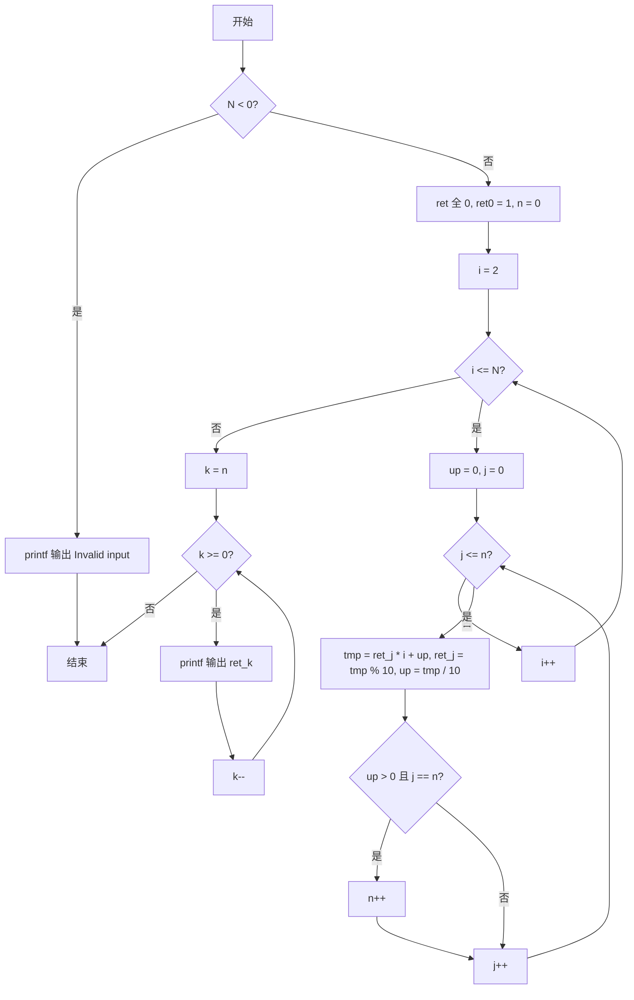
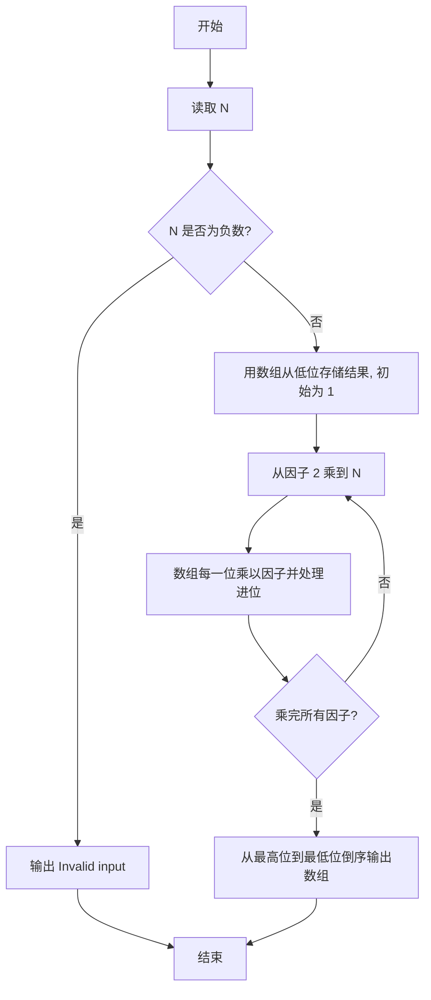

# PTA基础编程题目集 6-10阶乘计算升级版（C++语言实现）

## 题目描述

本题要求实现一个打印非负整数阶乘的函数。

### 函数接口定义

```cpp
void Print_Factorial ( const int N );
```

其中`N`是用户传入的参数，其值不超过1000。如果`N`是非负整数，则该函数必须在一行中打印出`N`!的值，否则打印"Invalid input"。

### 裁判测试程序样例

```cpp
#include <stdio.h>

void Print_Factorial ( const int N );

int main()
{
    int N;

    scanf("%d", &N);
    Print_Factorial(N);
    return 0;
}

/* 你的代码将被嵌在这里 */
```

### 输入样例

```in
15
```

### 输出样例

```out
1307674368000
```

## 函数部分

使用低位在前的数组模拟大整数乘法。每次把当前阶乘的每一位乘以新因子，再把进位继续传给更高位。

```cpp
void Print_Factorial(const int N)
{
    if (N < 0) {
        printf("Invalid input");
        return;
    }

    int digits[3000] = {1};
    int length = 1;
    for (int factor = 2; factor <= N; ++factor) {
        int carry = 0;
        for (int i = 0; i < length; ++i) {
            int product = digits[i] * factor + carry;
            digits[i] = product % 10;
            carry = product / 10;
        }
        while (carry > 0) {
            digits[length++] = carry % 10;
            carry /= 10;
        }
    }

    for (int i = length - 1; i >= 0; --i) {
        printf("%d", digits[i]);
    }
}
```

## 解题思路

这道题的核心是**大数乘法模拟**：N 最大为 1000，1000! 远超 int 范围，必须用数组逐位存储结果并模拟乘法进位，最后倒序输出每一位。

### 核心问题分析

1. **大数存储**：用数组 ret 从低位到高位逐位存储结果的每一位，初始 ret[0] = 1（即 0!）。
2. **乘法与进位**：每次乘法把数组的每一位乘以当前因子并处理进位：tmp = ret[j] * i + up，当前位存 tmp % 10，进位 up = tmp / 10。
3. **位数扩展**：如果进位 up > 0 且已处理到最高位（j == n），就扩展结果的位数 n++。
4. **非法输入**：N < 0 时输出 "Invalid input"。

### 算法原理说明

`N` 最大为 1000，`1000!` 远超 `int` 范围，必须用**大数乘法**模拟。思路：用数组 `ret` 从低位到高位逐位存储结果的每一位，初始 `ret[0] = 1`（即 0!）。从因子 2 乘到 `N`，每次乘法把数组的每一位乘以当前因子并处理进位；如果进位 `up > 0` 且已处理到最高位（`j == n`），就扩展结果的位数 `n`。最后从最高位到最低位倒序输出每一位即为最终阶乘结果。

### 具体计算步骤

1. 判断 N < 0：成立则 printf("Invalid input") 输出提示并结束。
2. 初始化进位 up = 0、临时结果 tmp = 0、结果位数 n = 0，数组 ret[3000] 全 0 且 ret[0] = 1。
3. 外层循环 i 从 2 到 N，每次把当前结果乘以 i。
4. 内层循环 j 从 0 到 n：tmp = ret[j] * i + up，当前位存 ret[j] = tmp % 10，进位 up = tmp / 10。
5. 若 up > 0 且已到最高位（j == n），执行 n++ 增加一位。
6. 所有因子乘完后，循环 k 从 n 递减到 0，用 printf("%d", ret[k]) 倒序输出每一位。


## 完整代码

```cpp
// 题目：6-10 阶乘计算升级版
// 要求：精确输出N!（N最大1000），负数打印Invalid input
//
// 实现原理：
//   数组按位存储结果，模拟大整数乘法与进位
#include <stdio.h>

void Print_Factorial(const int N);

int main()
{
    int N;
    scanf("%d", &N);
    Print_Factorial(N);
    return 0;
}

/* 用数组模拟大整数乘法，逐位打印N! */
void Print_Factorial(const int N)
{
    int up = 0; // 进位
    int tmp = 0;
    int n = 0; // 最高位下标
    int ret[3000] = {0};
    ret[0] = 1;
    if (N < 0) {
        printf("Invalid input");
    } else {
        for (int i = 2; i <= N; i++) {
            up = 0;
            for (int j = 0; j <= n; j++) {
                tmp = ret[j] * i + up;
                ret[j] = tmp % 10;
                up = tmp / 10;
                if (up > 0 && j == n) n++;
            }
        }
        for (int k = n; k >= 0; k--)
            printf("%d", ret[k]);
    }
}
```

下面仅给出需要嵌入裁判程序（位于 `/* 你的代码将被嵌在这里 */` 或 `/* 请在这里填写答案 */` 处）的函数实现，可直接复制到提交框：

## 代码流程说明

1. 判断 N < 0：成立则 printf("Invalid input") 输出提示并结束。
2. 初始化进位 up = 0、临时结果 tmp = 0、结果位数 n = 0，数组 ret[3000] 全 0 且 ret[0] = 1。
3. 外层循环 i 从 2 到 N，每次把当前结果乘以 i。
4. 内层循环 j 从 0 到 n：tmp = ret[j] * i + up，当前位存 ret[j] = tmp % 10，进位 up = tmp / 10。
5. 若 up > 0 且已到最高位（j == n），执行 n++ 增加一位。
6. 所有因子乘完后，循环 k 从 n 递减到 0，用 printf("%d", ret[k]) 倒序输出每一位。

## 代码流程图



## 解题流程图



## 复杂度分析

设最终结果 N! 有 `D` 位：

- 时间复杂度：`O(∑ᵢ₌₂ᴺ digits((i - 1)!))`，即每个因子都要遍历当前大整数的所有位；可粗略记为 `O(ND)`。
- 空间复杂度：`O(D)`，数组按位保存阶乘结果；本题中由固定数组容量限制。

## 常见易错点

1. `N < 0` 时应输出 `Invalid input`，不能进行阶乘计算。
2. 大整数数组通常低位在前，输出时必须从最高位倒序输出。
3. 每一位乘法都要同时处理进位，并在最高位仍有进位时扩展位数。
4. 初始结果应为 1，这样 `0!` 和 `1!` 都能正确输出。
