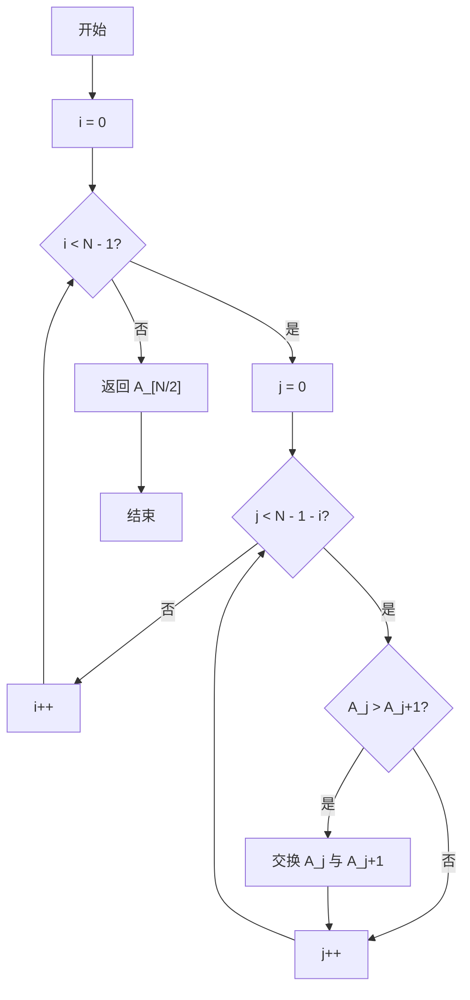
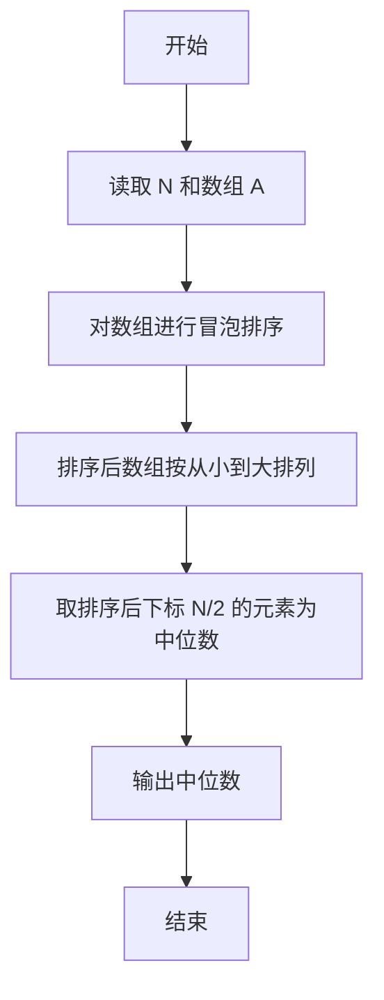

# PTA基础编程题目集 6-11求自定类型元素序列的中位数（C++语言实现）

## 题目描述

本题要求实现一个函数，求N个集合元素A[]的中位数，即序列中第⌊(N+1)/2⌋大的元素。其中集合元素的类型为自定义的ElementType。

### 函数接口定义

```cpp
ElementType Median( ElementType A[], int N );
```

其中给定集合元素存放在数组A[]中，正整数N是数组元素个数。该函数须返回N个A[]元素的中位数，其值也必须是ElementType类型。

### 裁判测试程序样例

```cpp
#include <stdio.h>

#define MAXN 10
typedef float ElementType;

ElementType Median( ElementType A[], int N );

int main ()
{
    ElementType A[MAXN];
    int N, i;

    scanf("%d", &N);
    for ( i=0; i<N; i++ )
        scanf("%f", &A[i]);
    printf("%.2f\n", Median(A, N));

    return 0;
}
/* 你的代码将被嵌在这里 */
```

### 输入样例

```in
3
12.3 34 -5
```

### 输出样例

```out
12.30
```

## 解题思路

这道题的核心是**排序后定位中位数**：中位数定义为排序后位于第 ⌊(N+1)/2⌋ 大的元素。先用冒泡排序把数组 A 从小到大排列，再根据下标公式 N / 2 直接取出中位数。

### 核心问题分析

1. **中位数定义**：中位数是排序后位于第 ⌊(N+1)/2⌋ 大的元素，等价于排序后下标 N / 2 处的元素。
2. **冒泡排序**：每轮把当前未排区间的最大值"冒泡"到最后，共需 N - 1 轮。
3. **下标定位**：排序完成后直接返回 A[N / 2]，即中位数。

### 算法原理说明

中位数定义为排序后位于第 ⌊(N+1)/2⌋ 大的元素。思路：先用冒泡排序把数组 `A` 从小到大排列，再根据下标公式 `N / 2` 直接取出中位数。冒泡排序每轮把当前未排区间的最大值"冒泡"到最后，共需 `N - 1` 轮。

### 具体计算步骤

1. 外层循环 i 从 0 到 N - 2，共执行 N - 1 轮冒泡。
2. 内层循环 j 从 0 到 N - 1 - i，比较相邻元素 A[j] 与 A[j + 1]。
3. 若 A[j] > A[j + 1]，用临时变量 temp 交换两者位置。
4. 排序完成后返回 A[N / 2]，即中位数。


## 完整代码

```cpp
// 题目：6-11 求自定类型元素序列的中位数
// 要求：返回N个元素的中位数（第⌊(N+1)/2⌋大）
//
// 实现原理：
//   冒泡排序后取A[N/2]
#include <stdio.h>

#define MAXN 10
typedef float ElementType;

ElementType Median(ElementType A[], int N);

int main()
{
    ElementType A[MAXN];
    int N, i;
    scanf("%d", &N);
    for (i = 0; i < N; i++)
        scanf("%f", &A[i]);
    printf("%.2f\n", Median(A, N));
    return 0;
}

/* 冒泡排序后返回中位数 */
ElementType Median(ElementType A[], int N)
{
    int i, j;
    ElementType temp;
    for (i = 0; i < N - 1; i++) {
        for (j = 0; j < N - 1 - i; j++) {
            if (A[j] > A[j + 1]) {
                temp = A[j];
                A[j] = A[j + 1];
                A[j + 1] = temp;
            }
        }
    }
    return A[N / 2];
}
```

下面仅给出需要嵌入裁判程序（位于 `/* 你的代码将被嵌在这里 */` 或 `/* 请在这里填写答案 */` 处）的函数实现，可直接复制到提交框：

## 代码流程说明

1. 外层循环 i 从 0 到 N - 2，共执行 N - 1 轮冒泡。
2. 内层循环 j 从 0 到 N - 1 - i，比较相邻元素 A[j] 与 A[j + 1]。
3. 若 A[j] > A[j + 1]，用临时变量 temp 交换两者位置。
4. 排序完成后返回 A[N / 2]，即中位数。

## 代码流程图



## 解题流程图


