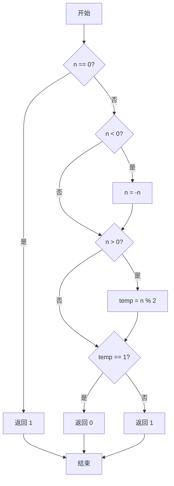
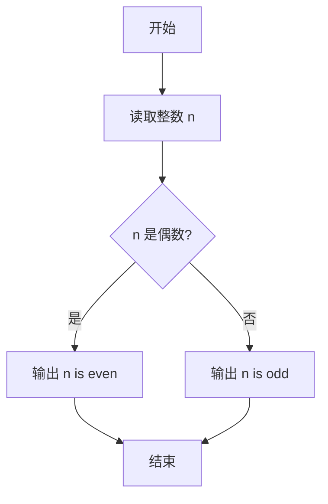

# PTA基础编程题目集 6-12判断奇偶性（C++语言实现）

## 题目描述

本题要求实现判断给定整数奇偶性的函数。

### 函数接口定义

```cpp
int even( int n );
```

其中`n`是用户传入的整型参数。当`n`为偶数时，函数返回1；`n`为奇数时返回0。注意：0是偶数。

### 裁判测试程序样例

```cpp
#include <stdio.h>

int even( int n );

int main()
{    
    int n;

    scanf("%d", &n);
    if (even(n))
        printf("%d is even.\n", n);
    else
        printf("%d is odd.\n", n);

    return 0;
}

/* 你的代码将被嵌在这里 */
```

### 输入样例1

```in
-6
```

### 输出样例1

```out
-6 is even.
```

### 输入样例2

```in
5
```

### 输出样例2

```out
5 is odd.
```

## 函数部分

函数的返回值直接由余数决定。C/C++ 中 `n % 2 == 0` 对正数、负数和 0 都成立于偶数情形。

```cpp
int even(int n)
{
    return n % 2 == 0 ? 1 : 0;
}
```

## 解题思路

这道题的核心是**取模判断奇偶**：判断奇偶性只需看 n 是否能被 2 整除，n % 2 == 1 说明是奇数，否则是偶数。题目约定偶数返回 1、奇数返回 0。

### 核心问题分析

1. **零的处理**：0 是偶数，n == 0 时单独返回 1。
2. **负数处理**：n < 0 时先取绝对值 n = -n，避免取模结果的符号干扰。
3. **取模判断**：n % 2 == 1 为奇数返回 0，否则（偶数）返回 1。

### 算法原理说明

判断奇偶性只需看 `n` 是否能被 2 整除：`n % 2 == 1` 说明是奇数，否则是偶数。题目约定偶数返回 1、奇数返回 0。代码先对 `n == 0` 单独返回 1（0 也是偶数），再把负数取绝对值，最后用 `temp = n % 2` 的结果判断：余数为 1 返回 0，否则返回 1。

### 具体计算步骤

1. 判断 n == 0：成立则返回 1（0 是偶数）。
2. 若 n < 0，执行 n = -n 取绝对值。
3. 若 n > 0，计算 temp = n % 2 得到余数。
4. 判断 temp == 1：成立（奇数）返回 0，否则返回 1（偶数）。


## 完整代码

```cpp
// 题目：6-12 判断奇偶性
// 要求：偶数返回1，奇数返回0（0视为偶数）
//
// 实现原理：
//   取绝对值后用n%2判断
#include <stdio.h>

int even(int n);

int main()
{
    int n;
    scanf("%d", &n);
    if (even(n))
        printf("%d is even.\n", n);
    else
        printf("%d is odd.\n", n);
    return 0;
}

/* 返回1表示偶数，0表示奇数 */
int even(int n)
{
    int temp;
    if (n == 0) return 1; // 0是偶数
    if (n < 0) n = -n;
    if (n > 0) temp = n % 2;
    if (temp == 1) return 0; // 奇数
    else return 1; // 偶数
}
```

下面仅给出需要嵌入裁判程序（位于 `/* 你的代码将被嵌在这里 */` 或 `/* 请在这里填写答案 */` 处）的函数实现，可直接复制到提交框：

## 代码流程说明

1. 判断 n == 0：成立则返回 1（0 是偶数）。
2. 若 n < 0，执行 n = -n 取绝对值。
3. 若 n > 0，计算 temp = n % 2 得到余数。
4. 判断 temp == 1：成立（奇数）返回 0，否则返回 1（偶数）。

## 代码流程图



## 解题流程图



## 复杂度分析

- 时间复杂度：`O(1)`，只进行一次取模判断。
- 空间复杂度：`O(1)`，只使用常数个变量。

## 常见易错点

1. 偶数返回 1，奇数返回 0，返回值含义不要写反。
2. 0 能被 2 整除，应判断为偶数。
3. 负数的余数符号可能与正数不同，但是否能被 2 整除的结论不变。
