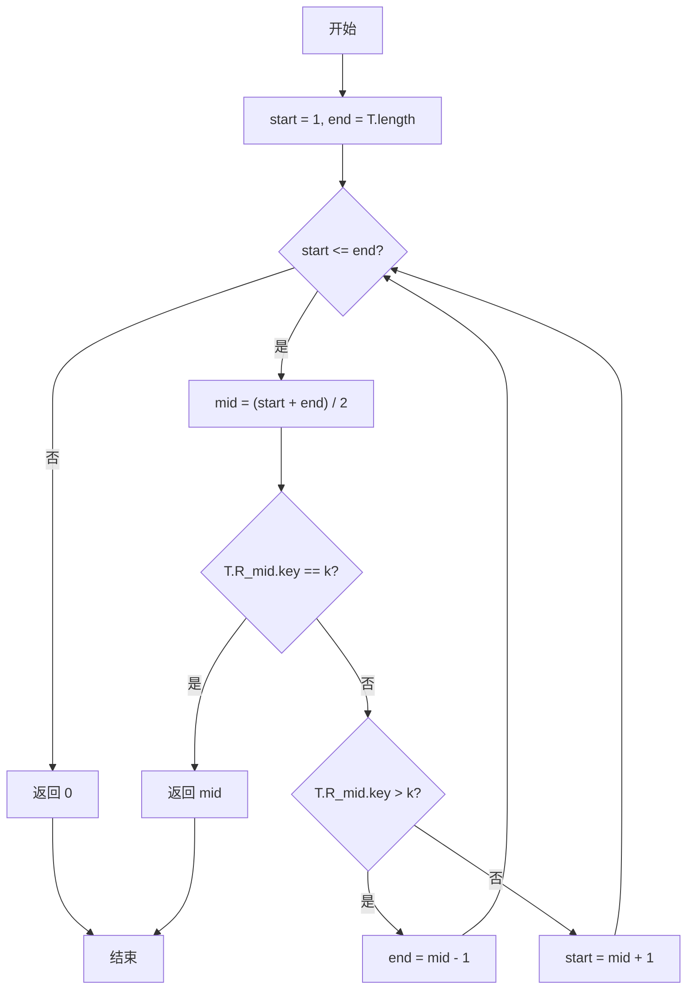
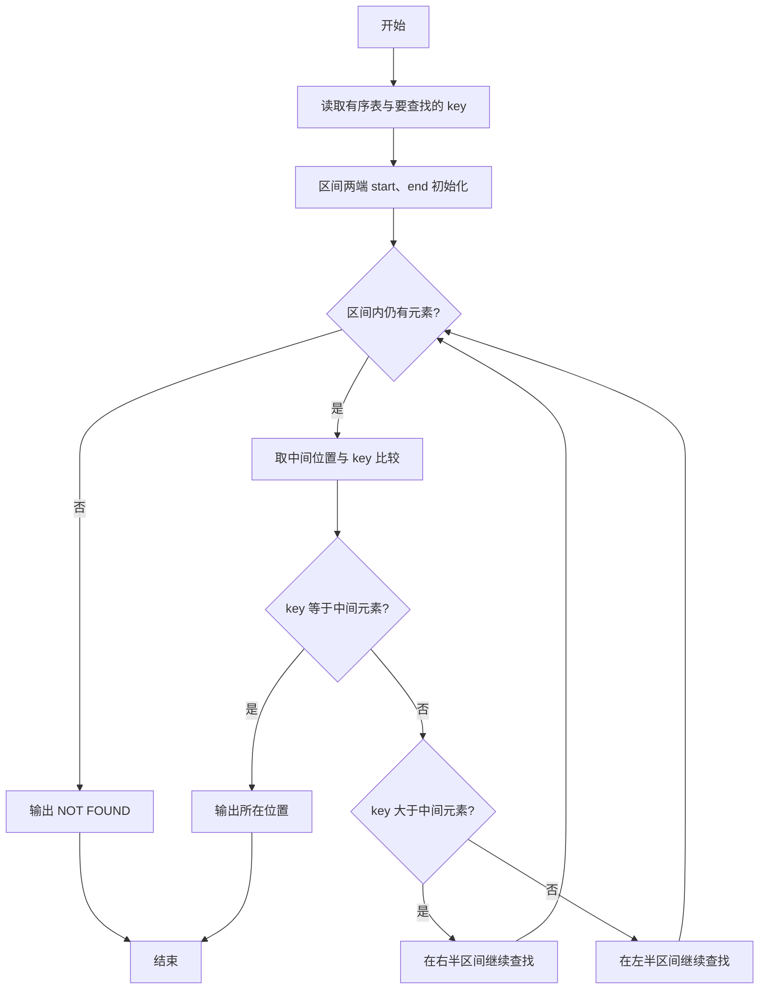

# PTA基础编程题目集 6-13折半查找（C++语言实现）

## 题目描述

给一个严格递增数列，函数int Search_Bin(SSTable T, KeyType k)用来二分地查找k在数列中的位置。

### 函数接口定义

```cpp
int  Search_Bin(SSTable T, KeyType k)
```

其中T是有序表，k是查找的值。

### 裁判测试程序样例

```cpp
#include <iostream>
using namespace std;

#define MAXSIZE 50
typedef int KeyType;

typedef  struct                     
{ KeyType  key;                                             
} ElemType;  

typedef  struct
{ ElemType  *R; 
  int  length;
} SSTable;                      

void  Create(SSTable &T)
{ int i;
  T.R=new ElemType[MAXSIZE+1];
  cin>>T.length;
  for(i=1;i<=T.length;i++)
     cin>>T.R[i].key;   
}

int  Search_Bin(SSTable T, KeyType k);

int main () 
{  SSTable T;  KeyType k;
   Create(T);
   cin>>k;
   int pos=Search_Bin(T,k);
   if(pos==0) cout<<"NOT FOUND"<<endl;
   else cout<<pos<<endl;
   return 0;
}

/* 请在这里填写答案 */
```

### 输入样例

```in
5
1 3 5 7 9
7
```

### 输出样例

```out
4
```

### 输入样例2

```in
5
1 3 5 7 9
10
```

### 输出样例2

```out
NOT FOUND
```

### 输入格式

第一行输入一个整数n，表示有序表的元素个数，接下来一行n个数字，依次为表内元素值。 然后输入一个要查找的值。

### 输出格式

输出这个值在表内的位置，如果没有找到，输出"NOT FOUND"。

## 函数部分

顺序表的有效元素从下标 1 开始。每次比较中间元素后，只保留可能包含目标值的一半区间，区间为空时返回 0。

```cpp
int Search_Bin(SSTable T, KeyType k)
{
    int low = 1;
    int high = T.length;

    while (low <= high) {
        int mid = low + (high - low) / 2;
        if (T.R[mid].key == k) {
            return mid;
        }
        if (T.R[mid].key < k) {
            low = mid + 1;
        } else {
            high = mid - 1;
        }
    }
    return 0;
}
```

## 解题思路

这道题的核心是**二分查找**：二分查找适用于有序表，核心思路是不断把查找区间折半，用 start、end 指向区间两端，取中间位置 mid 与 k 比较，相等则找到，否则根据大小关系收缩区间。

### 核心问题分析

1. **区间初始化**：start = 1，end = T.length，指向查找区间的两端。
2. **折半比较**：mid = (start + end) / 2，取中间位置与 k 比较。
3. **区间收缩**：T.R[mid].key < k 说明目标在右半区，start = mid + 1；T.R[mid].key > k 则目标在左半区，end = mid - 1。
4. **未找到**：当 start > end 时区间为空，说明未找到，返回 0。

### 算法原理说明

二分查找适用于有序表，核心思路是不断把查找区间折半：用 `start`、`end` 指向区间两端，取中间位置 `mid` 与 `k` 比较——相等则找到；`T.R[mid].key < k` 说明目标在右半区，把 `start` 移到 `mid + 1`；`T.R[mid].key > k` 则目标在左半区，把 `end` 移到 `mid - 1`。当 `start > end` 时区间为空，说明未找到，返回 0。

### 具体计算步骤

1. 初始化查找区间 start = 1，end = T.length。
2. while (start <= end) 循环：区间非空时继续查找。
3. 取中间位置 mid = (start + end) / 2。
4. 若 T.R[mid].key == k，直接返回 mid。
5. 若 T.R[mid].key > k，说明目标在左半区，end = mid - 1；否则目标在右半区，start = mid + 1。
6. 循环结束仍未找到，返回 0（表示未找到）。


## 完整代码

```cpp
// 题目：6-13 折半查找（二分查找）
// 要求：在严格递增有序表中查找k，找到返回下标（1起），否则0
//
// 实现原理：
//   二分查找，维护start、end区间，取mid比较后收缩
#include <iostream>
using namespace std;

#define MAXSIZE 50
typedef int KeyType;

typedef struct
{
    KeyType key;
} ElemType;

typedef struct
{
    ElemType *R;
    int length;
} SSTable;

void Create(SSTable &T)
{
    int i;
    T.R = new ElemType[MAXSIZE + 1];
    cin >> T.length;
    for (i = 1; i <= T.length; i++)
        cin >> T.R[i].key;
}

int Search_Bin(SSTable T, KeyType k);

int main()
{
    SSTable T;
    KeyType k;
    Create(T);
    cin >> k;
    int pos = Search_Bin(T, k);
    if (pos == 0) cout << "NOT FOUND" << endl;
    else cout << pos << endl;
    return 0;
}

/* 在有序顺序表上执行二分查找 */
int Search_Bin(SSTable T, KeyType k)
{
    int low = 1, high = T.length;
    while (low <= high) {
        int mid = (low + high) / 2;
        if (T.R[mid].key == k) return mid;
        else if (T.R[mid].key > k) high = mid - 1;
        else low = mid + 1;
    }
    return 0; // 未找到
}
```

下面仅给出需要嵌入裁判程序（位于 `/* 你的代码将被嵌在这里 */` 或 `/* 请在这里填写答案 */` 处）的函数实现，可直接复制到提交框：

## 代码流程说明

1. 初始化查找区间 start = 1，end = T.length。
2. while (start <= end) 循环：区间非空时继续查找。
3. 取中间位置 mid = (start + end) / 2。
4. 若 T.R[mid].key == k，直接返回 mid。
5. 若 T.R[mid].key > k，说明目标在左半区，end = mid - 1；否则目标在右半区，start = mid + 1。
6. 循环结束仍未找到，返回 0（表示未找到）。

## 代码流程图



## 解题流程图



## 复杂度分析

设有序表中有 `N` 个元素：

- 时间复杂度：`O(log N)`，每次比较后将查找区间缩小约一半。
- 空间复杂度：`O(1)`，采用迭代实现，只使用区间边界和中间位置变量。

## 常见易错点

1. 题目中的顺序表下标从 1 开始，因此 `low` 应初始化为 1。
2. 查找失败时必须返回 0，不能返回 -1 或任意越界位置。
3. `key` 小于中间值时应移动 `high`，大于中间值时应移动 `low`。
4. 每轮都要缩小区间，否则可能造成死循环。
