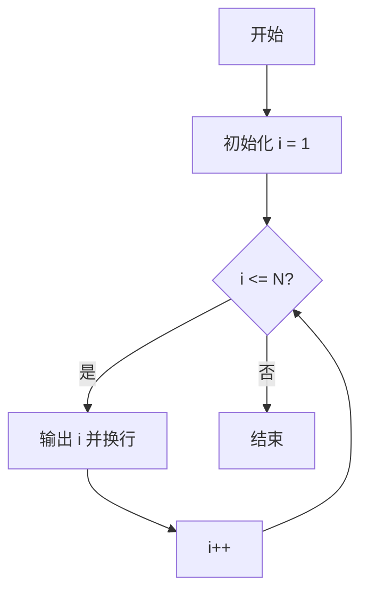
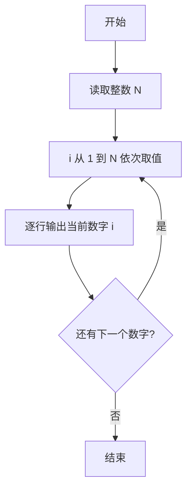

# PTA基础编程题目集 6-1简单输出整数（C++语言实现）

## 题目描述

本题要求实现一个函数，对给定的正整数`N`，打印从1到`N`的全部正整数。

### 函数接口定义

```cpp
void PrintN ( int N );
```

其中`N`是用户传入的参数。该函数必须将从1到`N`的全部正整数顺序打印出来，每个数字占1行。

### 裁判测试程序样例

```cpp
#include <stdio.h>

void PrintN ( int N );

int main ()
{
    int N;

    scanf("%d", &N);
    PrintN( N );

    return 0;
}

/* 你的代码将被嵌在这里 */
```

### 输入样例

```in
3
```

### 输出样例

```out
1
2
3
```

## 函数部分

函数不需要保存序列，只需在循环中直接完成输出。循环变量从 1 开始，达到 N 后结束。

```cpp
void PrintN(int N)
{
    for (int i = 1; i <= N; ++i) {
        printf("%d\n", i);
    }
}
```

## 解题思路

这道题的核心是**顺序输出整数序列**：函数收到参数 N 后，把 1 到 N 的每个整数按行打印出来，不需要返回值。

### 核心问题分析

1. **输出范围**：从 1 到 N 共 N 个正整数，全部逐行输出。
2. **输出格式**：每个数字占 1 行，即每次打印后换行。
3. **返回值**：函数为 void 类型，循环结束即完成输出，无需返回任何值。

### 算法原理说明

使用 for 循环让循环变量 i 从 1 递增到 N，循环体内调用 `printf("%d\n", i)` 输出当前数字并换行。循环结束即完成全部输出。

### 具体计算步骤

1. for 循环初始化循环变量 i = 1。
2. 判断 i <= N 是否成立：成立则进入循环体，不成立则函数结束。
3. 循环体内调用 `printf("%d\n", i)` 输出当前数字并换行。
4. 执行 i++ 使循环变量自增，回到第 2 步继续判断。


## 完整代码

```cpp
// 题目：6-1 简单输出整数
// 要求：对给定的正整数N，打印从1到N的全部正整数，每行一个
//
// 实现原理：
//   1. 用for循环控制变量i从1递增到N
//   2. 循环体内用printf("%d\n", i)逐行输出
//   3. 函数无返回值，直接打印即可
#include <stdio.h>

void PrintN(int N);

int main()
{
    int N;
    scanf("%d", &N);
    PrintN(N);
    return 0;
}

/* 你的代码将被嵌在这里 */
void PrintN(int N)
{
    int i;
    for (i = 1; i <= N; i++)
        printf("%d\n", i);
}
```

下面仅给出需要嵌入裁判程序（位于 `/* 你的代码将被嵌在这里 */` 或 `/* 请在这里填写答案 */` 处）的函数实现，可直接复制到提交框：

## 代码流程说明

1. for 循环初始化循环变量 i = 1。
2. 判断 i <= N 是否成立：成立则进入循环体，不成立则结束函数。
3. 循环体内调用 `printf("%d\n", i)` 输出当前数字并换行。
4. 执行 i++ 使循环变量自增，回到第 2 步继续判断。

## 代码流程图



## 解题流程图



## 复杂度分析

- 时间复杂度：`O(N)`，需要输出 N 个整数。
- 空间复杂度：`O(1)`，只使用循环变量。

## 常见易错点

1. 循环应从 1 开始，并且要包含 N。
2. 每输出一个整数都要换行。
3. 函数接口为 `void`，不需要返回值。
