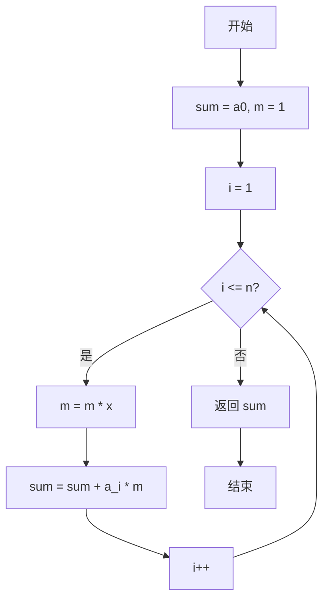
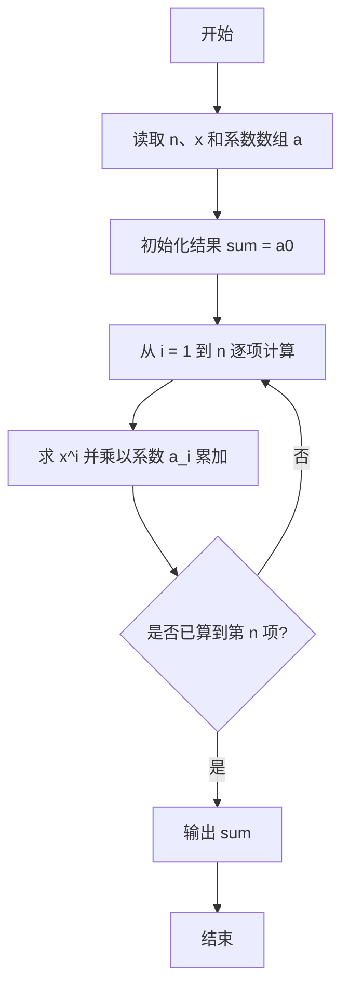

# PTA基础编程题目集 6-2多项式求值（C++语言实现）

## 题目描述

本题要求实现一个函数，计算阶数为`n`，系数为`a[0]` ... `a[n]`的多项式*f*(*x*)=∑^n^~i=0~*(*a*[*i*]*×x^i^) 在`x`点的值。

### 函数接口定义

```cpp
double f( int n, double a[], double x );
```

其中`n`是多项式的阶数，`a[]`中存储系数，`x`是给定点。函数须返回多项式`f(x)`的值。

### 裁判测试程序样例

```cpp
#include <stdio.h>

#define MAXN 10

double f( int n, double a[], double x );

int main()
{
    int n, i;
    double a[MAXN], x;

    scanf("%d %lf", &n, &x);
    for ( i=0; i<=n; i++ )
        scanf(“%lf”, &a[i]);
    printf("%.1f\n", f(n, a, x));
    return 0;
}

/* 你的代码将被嵌在这里 */
```

### 输入样例

```in
2 1.1
1 2.5 -38.7
```

### 输出样例

```out
-43.1
```

## 解题思路

这道题的核心是**逐项累乘**：先计算 x^i 再乘以系数 a[i] 累加，用变量 m 保存当前的 x^i，每轮迭代 m *= x 即可得到 x^(i+1)，从而在 O(n) 时间内完成求值。

### 核心问题分析

1. **幂的计算**：多项式各项含 x^i，若每项都重新计算幂会浪费大量时间。
2. **累乘递推**：用变量 m 保存当前 x^i（初始为 1），每轮 m *= x 得到下一项的幂。
3. **常数项处理**：sum 初始化为 a[0]，即把 x^0 项（a[0]）排除在循环之外。

### 算法原理说明

多项式求值通常用**逐项累乘**的方式：sum 初始化为 a[0]，循环变量 i 从 1 到 n，每轮先 m *= x 得到 x^i，再累加 sum += a[i] * m。这样每项只做一次乘法和一次加法，总复杂度为 O(n)。

### 具体计算步骤

1. 用 sum = a[0] 保存常数项，m = 1 表示 x^0。
2. 循环变量 i 从 1 递增到 n。
3. 每轮先 m *= x 得到 x^i，再累加 sum += a[i] * m。
4. 循环结束后返回 sum，即为多项式在 x 点的值。


## 完整代码

```cpp
// 题目：6-2 多项式求值
// 要求：计算多项式f(x)=a0+a1*x+...+an*x^n在给定x处的值
//
// 实现原理：
//   逐项累加法，用m保存x的幂次，初始m=1
//   sum=a0，每轮m*=x得到x^i，再累加a[i]*m
#include <stdio.h>

#define MAXN 10

double f(int n, double a[], double x);

int main()
{
    int n, i;
    double a[MAXN], x;
    scanf("%d %lf", &n, &x);
    for (i = 0; i <= n; i++)
        scanf("%lf", &a[i]);
    printf("%.1f\n", f(n, a, x));
    return 0;
}

/* 逐项累加计算多项式值 */
double f(int n, double a[], double x)
{
    double sum = a[0]; // 常数项
    double m = 1;      // 保存x^i
    int i;
    for (i = 1; i <= n; i++) {
        m *= x;            // 更新为x^i
        sum += a[i] * m;   // 累加该项
    }
    return sum;
}
```

下面仅给出需要嵌入裁判程序（位于 `/* 你的代码将被嵌在这里 */` 或 `/* 请在这里填写答案 */` 处）的函数实现，可直接复制到提交框：

## 代码流程说明

1. 用 sum = a[0] 保存常数项，m = 1 表示 x^0。
2. 循环变量 i 从 1 递增到 n。
3. 每轮先 m *= x 得到 x^i，再累加 sum += a[i] * m。
4. 循环结束后返回 sum，即为多项式在 x 点的值。

## 代码流程图



## 解题流程图


