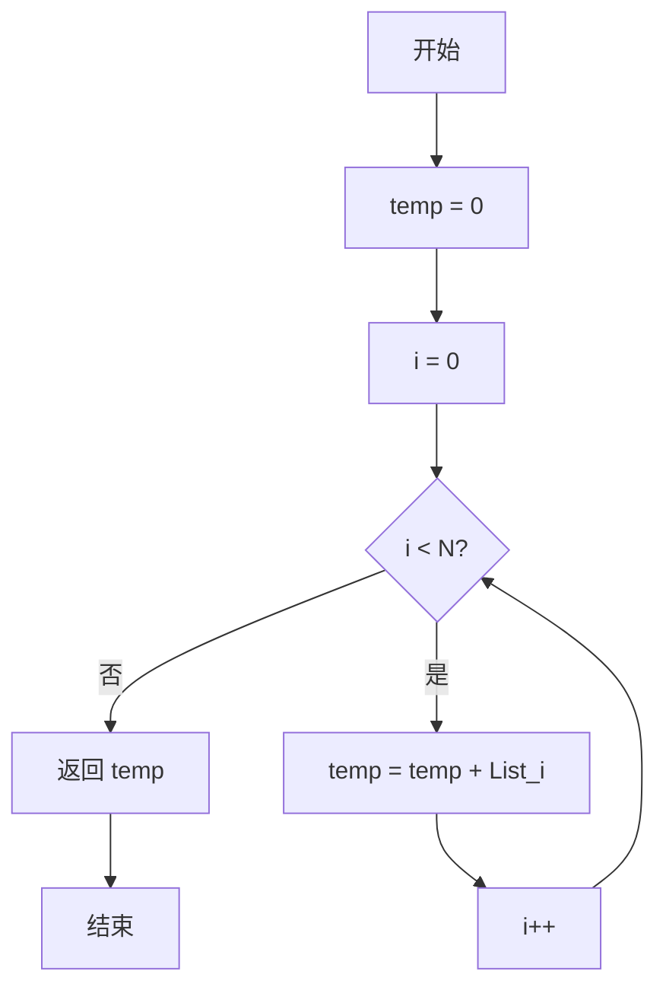
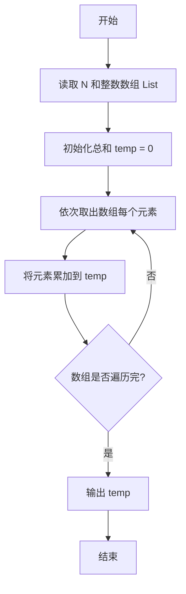

# PTA基础编程题目集 6-3简单求和（C++语言实现）

## 题目描述

本题要求实现一个函数，求给定的`N`个整数的和。

### 函数接口定义

```cpp
int Sum ( int List[], int N );
```

其中给定整数存放在数组`List[]`中，正整数`N`是数组元素个数。该函数须返回`N`个`List[]`元素的和。

### 裁判测试程序样例

```cpp
#include <stdio.h>

#define MAXN 10

int Sum ( int List[], int N );

int main ()
{
    int List[MAXN], N, i;

    scanf("%d", &N);
    for ( i=0; i<N; i++ )
        scanf("%d", &List[i]);
    printf("%d\n", Sum(List, N));

    return 0;
}

/* 你的代码将被嵌在这里 */
```

### 输入样例

```in
3
12 34 -5
```

### 输出样例

```out
41
```

## 函数部分

使用一个整型变量保存当前总和，顺序访问数组中的每个有效下标即可完成函数要求。

```cpp
int Sum(int List[], int N)
{
    int total = 0;
    for (int i = 0; i < N; ++i) {
        total += List[i];
    }
    return total;
}
```

## 解题思路

这道题的核心是**累加求和**：用变量 temp 保存累加结果（初始为 0），遍历数组 List 的每个元素，依次把元素值累加到 temp 中，遍历结束后 temp 就是所有 N 个整数的和。

### 核心问题分析

1. **累加器**：用 temp 保存累加结果，初始为 0。
2. **遍历范围**：循环变量 i 从 0 到 N - 1，覆盖数组的全部下标。
3. **返回值**：循环结束后返回累加总和 temp。

### 算法原理说明

求和的核心思路是用一个变量 temp 作为累加器，遍历数组 List 的每个元素，每轮执行 temp = temp + List[i]，把当前元素加入总和。遍历结束后 temp 即为所有 N 个整数的和，时间复杂度为 O(N)。

### 具体计算步骤

1. 初始化 temp = 0。
2. 循环变量 i 从 0 递增到 N - 1。
3. 每轮执行 temp = temp + List[i]，把当前元素加入总和。
4. 循环结束后返回 temp。


## 完整代码

```cpp
// 题目：6-3 简单求和
// 要求：实现函数Sum(List[], N)，返回N个整数的累加和
//
// 实现原理：
//   线性累加，用temp作为累加器遍历数组
#include <stdio.h>

#define MAXN 10

int Sum(int List[], int N);

int main()
{
    int List[MAXN], N, i;
    scanf("%d", &N);
    for (i = 0; i < N; i++)
        scanf("%d", &List[i]);
    printf("%d\n", Sum(List, N));
    return 0;
}

/* 遍历数组求和 */
int Sum(int List[], int N)
{
    int i;
    int temp = 0; // 累加器
    for (i = 0; i < N; i++)
        temp = temp + List[i];
    return temp;
}
```

下面仅给出需要嵌入裁判程序（位于 `/* 你的代码将被嵌在这里 */` 或 `/* 请在这里填写答案 */` 处）的函数实现，可直接复制到提交框：

## 代码流程说明

1. 初始化 temp = 0。
2. 循环变量 i 从 0 递增到 N - 1，覆盖数组的全部下标。
3. 每轮执行 temp = temp + List[i]，把当前元素加入总和。
4. 循环结束后返回 temp。

## 代码流程图



## 解题流程图



## 复杂度分析

- 时间复杂度：`O(N)`，需要遍历数组一次。
- 空间复杂度：`O(1)`，只使用累加器和循环变量。

## 常见易错点

1. 累加器必须初始化为 0。
2. 下标范围应为 `0` 到 `N - 1`，不能漏掉首尾元素。
3. 函数只负责返回总和，输入和输出由裁判程序完成。
