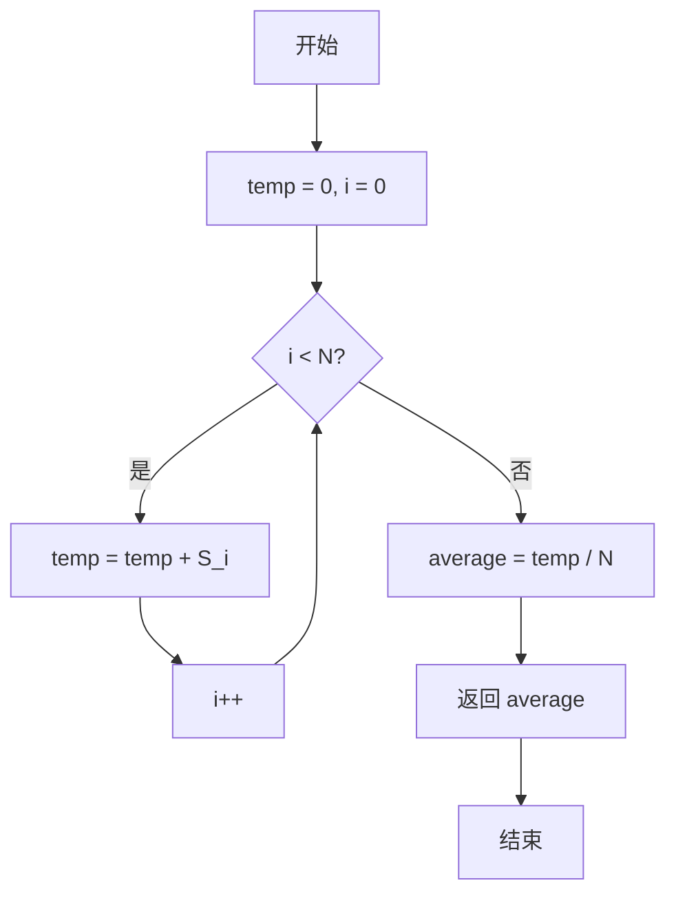
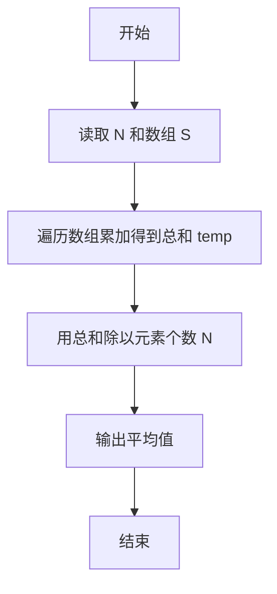

# PTA基础编程题目集 6-4求自定类型元素的平均（C++语言实现）

## 题目描述

本题要求实现一个函数，求`N`个集合元素`S[]`的平均值，其中集合元素的类型为自定义的`ElementType`。

### 函数接口定义

```cpp
ElementType Average( ElementType S[], int N );
```

其中给定集合元素存放在数组`S[]`中，正整数`N`是数组元素个数。该函数须返回`N`个`S[]`元素的平均值，其值也必须是`ElementType`类型。

### 裁判测试程序样例

```cpp
#include <stdio.h>

#define MAXN 10
typedef float ElementType;

ElementType Average( ElementType S[], int N );

int main ()
{
    ElementType S[MAXN];
    int N, i;

    scanf("%d", &N);
    for ( i=0; i<N; i++ )
        scanf("%f", &S[i]);
    printf("%.2f\n", Average(S, N));

    return 0;
}

/* 你的代码将被嵌在这里 */
```

### 输入样例

```in
3
12.3 34 -5
```

### 输出样例

```out
13.77
```

## 解题思路

这道题的核心是**求和后求平均**：平均值 = 元素总和 ÷ 元素个数。先遍历数组 S 把全部元素累加得到总和 temp，再用 temp 除以元素个数 N。

### 核心问题分析

1. **总和计算**：遍历数组 S 累加全部元素，得到总和 temp。
2. **浮点精度**：用 double 类型的 temp 累加总和，避免浮点累加的精度损失。
3. **除法类型**：temp 是 double 类型，除以整数 N 会自动进行浮点除法，保证平均值为小数。

### 算法原理说明

平均值 = 元素总和 ÷ 元素个数。思路是先遍历数组 `S` 把全部元素累加得到总和 `temp`，再用 `temp` 除以元素个数 `N`。因为 `temp` 是 `double` 类型，除以整数 `N` 会自动进行浮点除法，保证平均值为小数。

### 具体计算步骤

1. 初始化 i = 0、temp = 0，用 double 类型的 temp 累加总和。
2. for 循环变量 i 从 0 递增到 N - 1，每轮执行 temp = temp + S[i]。
3. 循环结束后计算 average = temp / N，得到平均值。
4. 返回 average。


## 完整代码

```cpp
// 题目：6-4 求自定类型元素的平均
// 要求：实现函数Average(S[], N)，返回N个元素的平均值
//
// 实现原理：
//   先累加求和再除以N，用double作累加器保证精度
#include <stdio.h>

#define MAXN 10
typedef float ElementType;

ElementType Average(ElementType S[], int N);

int main()
{
    ElementType S[MAXN];
    int N, i;
    scanf("%d", &N);
    for (i = 0; i < N; i++)
        scanf("%f", &S[i]);
    printf("%.2f\n", Average(S, N));
    return 0;
}

/* 先求和再除以N得到平均值 */
ElementType Average(ElementType S[], int N)
{
    int i = 0;
    double temp = 0; // 累加器，用double防止精度丢失
    for (; i < N; i++)
        temp = temp + S[i];
    return temp / N;
}
```

下面仅给出需要嵌入裁判程序（位于 `/* 你的代码将被嵌在这里 */` 或 `/* 请在这里填写答案 */` 处）的函数实现，可直接复制到提交框：

## 代码流程说明

1. 初始化 i = 0、temp = 0，用 double 类型的 temp 累加总和。
2. for 循环变量 i 从 0 递增到 N - 1，每轮执行 temp = temp + S[i]。
3. 循环结束后计算 average = temp / N，得到平均值。
4. 返回 average。

## 代码流程图



## 解题流程图


