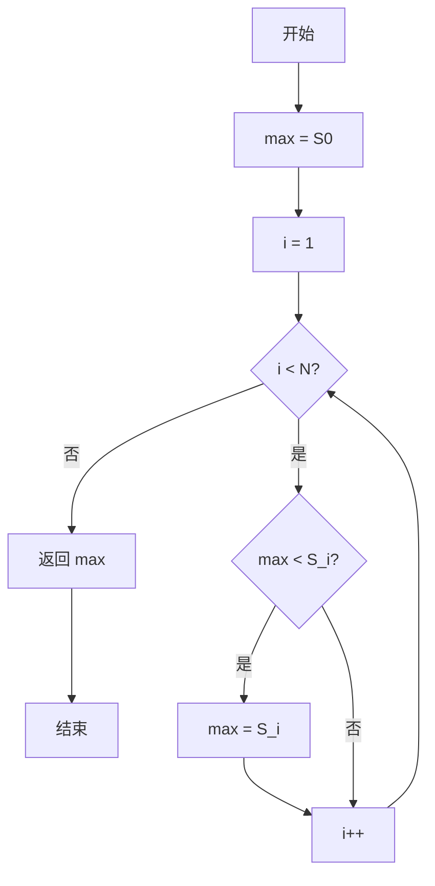
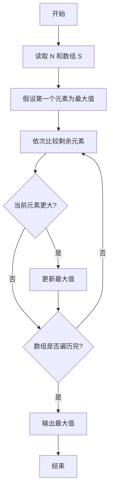

# PTA基础编程题目集 6-5求自定类型元素的最大值（C++语言实现）

## 题目描述

本题要求实现一个函数，求`N`个集合元素`S[]`中的最大值，其中集合元素的类型为自定义的`ElementType`。

### 函数接口定义

```cpp
ElementType Max( ElementType S[], int N );
```

其中给定集合元素存放在数组`S[]`中，正整数`N`是数组元素个数。该函数须返回`N`个`S[]`元素中的最大值，其值也必须是`ElementType`类型。

### 裁判测试程序样例

```cpp
#include <stdio.h>

#define MAXN 10
typedef float ElementType;

ElementType Max( ElementType S[], int N );

int main ()
{
    ElementType S[MAXN];
    int N, i;

    scanf("%d", &N);
    for ( i=0; i<N; i++ )
        scanf("%f", &S[i]);
    printf("%.2f\n", Max(S, N));

    return 0;
}

/* 你的代码将被嵌在这里 */
```

### 输入样例

```in
3
12.3 34 -5
```

### 输出样例

```out
34.00
```

## 解题思路

这道题的核心是**打擂台求最大值**：先把第一个元素 S[0] 当作当前最大值 max，然后从第二个元素开始依次与 max 比较，凡是比 max 大的元素就更新 max。

### 核心问题分析

1. **打擂台思想**：先把 S[0] 当作初始最大值 max。
2. **逐个比较**：从 S[1] 开始依次与 max 比较，比 max 大就更新。
3. **遍历结束**：遍历完所有元素后 max 即为整个数组的最大值。

### 算法原理说明

求最大值采用"打擂台"思路：先把第一个元素 `S[0]` 当作当前最大值 `max`，然后从第二个元素开始依次与 `max` 比较，凡是比 `max` 大的元素就更新 `max`。遍历结束后 `max` 即为整个数组的最大值。

### 具体计算步骤

1. 初始化 max = S[0]，把首元素作为初始最大值。
2. 循环变量 i 从 1 递增到 N - 1。
3. 判断 max < S[i]：成立则把 max 更新为 S[i]。
4. 循环结束后返回 max。


## 完整代码

```cpp
// 题目：6-5 求自定类型元素的最大值
// 要求：实现函数Max(S[], N)，返回N个元素中的最大值
//
// 实现原理：
//   打擂台法，先令max=S[0]，遍历剩余元素更新最大值
#include <stdio.h>

#define MAXN 10
typedef float ElementType;

ElementType Max(ElementType S[], int N);

int main()
{
    ElementType S[MAXN];
    int N, i;
    scanf("%d", &N);
    for (i = 0; i < N; i++)
        scanf("%f", &S[i]);
    printf("%.2f\n", Max(S, N));
    return 0;
}

/* 一次遍历找出最大值 */
ElementType Max(ElementType S[], int N)
{
    int i;
    ElementType max = S[0]; // 以首元素为初值
    for (i = 1; i < N; i++) {
        if (max < S[i])
            max = S[i]; // 更新最大值
    }
    return max;
}
```

下面仅给出需要嵌入裁判程序（位于 `/* 你的代码将被嵌在这里 */` 或 `/* 请在这里填写答案 */` 处）的函数实现，可直接复制到提交框：

## 代码流程说明

1. 初始化 max = S[0]，把首元素作为初始最大值。
2. 循环变量 i 从 1 递增到 N - 1。
3. 判断 max < S[i]：成立则把 max 更新为 S[i]。
4. 循环结束后返回 max。

## 代码流程图



## 解题流程图


