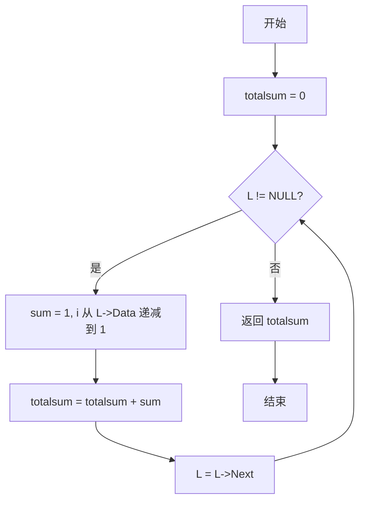
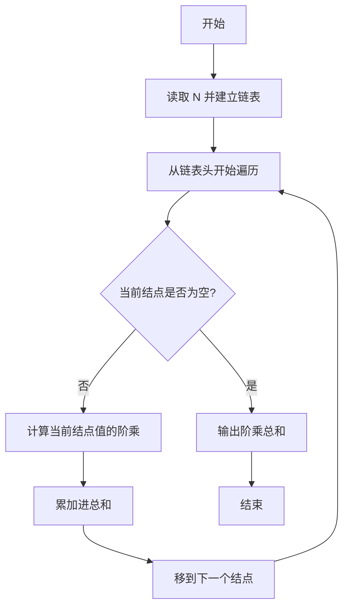

# PTA基础编程题目集 6-6求单链表结点的阶乘和（C++语言实现）

## 题目描述

本题要求实现一个函数，求单链表`L`结点的阶乘和。这里默认所有结点的值非负，且题目保证结果在`int`范围内。

### 函数接口定义

```cpp
int FactorialSum( List L );
```

其中单链表`List`的定义如下：

```cpp
typedef struct Node *PtrToNode;
struct Node {
    int Data; /* 存储结点数据 */
    PtrToNode Next; /* 指向下一个结点的指针 */
};
typedef PtrToNode List; /* 定义单链表类型 */
```

### 裁判测试程序样例

```cpp
#include <stdio.h>
#include <stdlib.h>

typedef struct Node *PtrToNode;
struct Node {
    int Data; /* 存储结点数据 */
    PtrToNode Next; /* 指向下一个结点的指针 */
};
typedef PtrToNode List; /* 定义单链表类型 */

int FactorialSum( List L );

int main()
{
    int N, i;
    List L, p;

    scanf("%d", &N);
    L = NULL;
    for ( i=0; i<N; i++ ) {
        p = (List)malloc(sizeof(struct Node));
        scanf("%d", &p->Data);
        p->Next = L;  L = p;
    }
    printf("%d\n", FactorialSum(L));

    return 0;
}

/* 你的代码将被嵌在这里 */
```

### 输入样例

```in
3
5 3 6
```

### 输出样例

```out
846
```

## 函数部分

函数参数 `L` 直接指向链表头。每次取出当前结点的数据计算阶乘，累加后再沿 `Next` 指针前进。

```cpp
int FactorialSum(List L)
{
    int total = 0;
    while (L != NULL) {
        int factorial = 1;
        for (int i = 2; i <= L->Data; ++i) {
            factorial *= i;
        }
        total += factorial;
        L = L->Next;
    }
    return total;
}
```

## 解题思路

这道题的核心是**链表遍历累加阶乘**：从链表头 L 开始遍历，只要结点不为空，就对当前结点的 Data 值计算阶乘并累加到 totalsum，然后让 L 指向下一个结点，直到链表遍历完毕。

### 核心问题分析

1. **链表遍历**：从链表头 L 开始，用 while (L != NULL) 循环，结点非空就进入循环体。
2. **阶乘计算**：对当前结点的 Data 值计算阶乘，sum 从 1 开始，i 从 Data 递减到 1 累乘。
3. **累加与移动**：将阶乘累加进 totalsum，再让 L = L->Next 移动到下一个结点。

### 算法原理说明

题目要求求单链表中所有结点值的阶乘之和。思路：从链表头 `L` 开始遍历，只要结点不为空，就对当前结点的 `Data` 值计算阶乘并累加到 `totalsum`，然后让 `L` 指向下一个结点，直到链表遍历完毕，返回总和。

### 具体计算步骤

1. 初始化 totalsum = 0。
2. while (L != NULL) 循环遍历链表：结点非空则进入循环体。
3. 对当前结点值计算阶乘：sum 从 1 开始，for 循环变量 i 从 L->Data 递减到 1，每轮执行 sum = sum * i。
4. 将阶乘累加进 totalsum，指针后移 L = L->Next。
5. 链表遍历完后返回 totalsum。


## 完整代码

```cpp
// 题目：6-6 求单链表结点的阶乘和
// 要求：遍历单链表，求每个结点Data的阶乘之和
//
// 实现原理：
//   while遍历链表，对每个Data用循环计算阶乘后累加
#include <stdio.h>
#include <stdlib.h>

typedef struct Node *PtrToNode;
struct Node {
    int Data; // 存储结点数据
    PtrToNode Next; // 指向下一个结点的指针
};
typedef PtrToNode List; // 定义单链表类型

int FactorialSum(List L);

int main()
{
    int N, i;
    List L, p;
    scanf("%d", &N);
    L = NULL;
    for (i = 0; i < N; i++) {
        p = (List)malloc(sizeof(struct Node));
        scanf("%d", &p->Data);
        p->Next = L;  L = p; // 头插法
    }
    printf("%d\n", FactorialSum(L));
    return 0;
}

/* 遍历链表，逐点计算阶乘并求和 */
int FactorialSum(List L)
{
    int i;
    int sum, totalsum = 0;
    while (L != NULL) {
        sum = 1;
        for (i = L->Data; i >= 1; i--) {
            sum = sum * i; // 计算当前结点阶乘
        }
        totalsum += sum; // 累加
        L = L->Next;
    }
    return totalsum;
}
```

下面仅给出需要嵌入裁判程序（位于 `/* 你的代码将被嵌在这里 */` 或 `/* 请在这里填写答案 */` 处）的函数实现，可直接复制到提交框：

## 代码流程说明

1. 初始化 totalsum = 0。
2. while (L != NULL) 循环遍历链表：结点非空则进入循环体。
3. 对当前结点值计算阶乘：sum 从 1 开始，for 循环变量 i 从 L->Data 递减到 1，每轮执行 sum = sum * i。
4. 将阶乘累加进 totalsum，指针后移 L = L->Next。
5. 链表遍历完后返回 totalsum。

## 代码流程图



## 解题流程图



## 复杂度分析

设链表有 `n` 个结点，第 `i` 个结点的值为 `vᵢ`：

- 时间复杂度：`O(n + ∑vᵢ)`，包括遍历结点和计算各结点阶乘的成本。
- 空间复杂度：`O(1)`，只使用固定数量的辅助变量，不创建新结点。

## 常见易错点

1. 每处理完一个结点都要执行 `L = L->Next`，否则会陷入死循环。
2. 阶乘累乘的初值应为 1，`0!` 也应得到 1。
3. 题目采用头插法建立链表，函数只需按当前链表顺序遍历；阶乘和与顺序无关。
4. 不要在函数中重复释放或修改裁判程序负责管理的结点。
