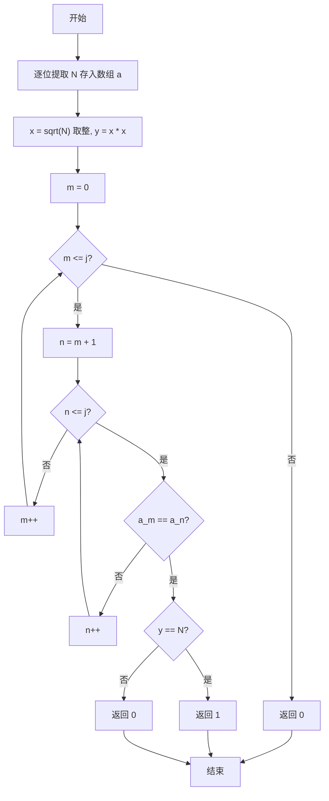
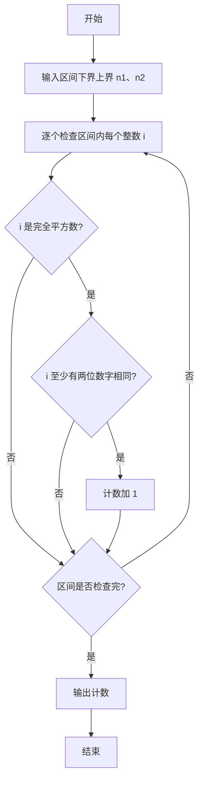

# PTA基础编程题目集 6-7统计某类完全平方数（C++语言实现）

## 题目描述

本题要求实现一个函数，判断任一给定整数`N`是否满足条件：它是完全平方数，又至少有两位数字相同，如144、676等。

### 函数接口定义

```cpp
int IsTheNumber ( const int N );
```

其中`N`是用户传入的参数。如果`N`满足条件，则该函数必须返回1，否则返回0。

### 裁判测试程序样例

```cpp
#include <stdio.h>
#include <math.h>

int IsTheNumber ( const int N );

int main()
{
    int n1, n2, i, cnt;

    scanf("%d %d", &n1, &n2);
    cnt = 0;
    for ( i=n1; i<=n2; i++ ) {
        if ( IsTheNumber(i) )
            cnt++;
    }
    printf("cnt = %d\n", cnt);

    return 0;
}

/* 你的代码将被嵌在这里 */
```

### 输入样例

```in
105 500
```

### 输出样例

```out
cnt = 6
```

## 解题思路

这道题的核心是**双重条件判断**：同时满足"完全平方数"和"至少有两位数字相同"两个条件才返回 1。先逐位提取 N 的数字，再用双重循环两两比较各位数字，同时验证完全平方数。

### 核心问题分析

1. **逐位提取**：用 while (M >= 10) 循环取模，把 M % 10 存入数组 a，最后把最高位存入 a[j]。
2. **相同数字检测**：双重循环两两比较 a[m] 与 a[n]，只要找到任意两位相同即可。
3. **完全平方数验证**：计算 x = (int)sqrt(N)、y = x * x，用 y == N 判断 N 是否为完全平方数。

### 算法原理说明

题目要求同时满足两个条件：① 完全平方数；② 至少有两位数字相同。思路分两步：先用 `while (M >= 10)` 循环取模逐位提取 `N` 的每一位存入数组 `a`，再用双重循环两两比较各位数字，只要找到任意两位相同；同时计算 `x = (int)sqrt(N)`、`y = x * x`，用 `y == N` 验证是否为完全平方数，两者同时成立才返回 1。

### 具体计算步骤

1. 用 M = N 复制原值，while (M >= 10) 循环把 M % 10 存入数组 a 并执行 M = M / 10，最后把最高位 a[j] = M，完成逐位提取。
2. 计算 x = (int)sqrt(N)，y = x * x，用于判断完全平方数。
3. 双重循环：外层 m 从 0 到 j，内层 n 从 m + 1 到 j，两两比较 a[m] 与 a[n]。
4. 若找到相同数字：再判断 y == N 是否成立，成立则返回 1（同时满足条件），否则返回 0。
5. 双重循环结束仍未找到相同数字，返回 0。


## 完整代码

```cpp
// 题目：6-7 统计某类完全平方数
// 要求：判断N是否为完全平方数且至少有两位数字相同
//
// 实现原理：
//   逐位拆分存数组，双重循环检查重复数字，sqrt判断完全平方
#include <stdio.h>
#include <math.h>

int IsTheNumber(const int N);

int main()
{
    int n1, n2, i, cnt;
    scanf("%d %d", &n1, &n2);
    cnt = 0;
    for (i = n1; i <= n2; i++) {
        if (IsTheNumber(i))
            cnt++;
    }
    printf("cnt = %d\n", cnt);
    return 0;
}

/* 判断N是否完全平方且含重复数字 */
int IsTheNumber(const int N)
{
    int M = N;
    int j = 0;
    int a[10]; // 存放各位数字
    while (M >= 10) {
        a[j++] = M % 10;
        M = M / 10;
    }
    a[j] = M; // 最高位
    int x = (int)sqrt(N);
    int y = x * x;
    int m, n;
    for (m = 0; m <= j; m++) {
        for (n = m + 1; n <= j; n++) {
            if (a[m] == a[n]) {
                if (y == N) return 1;
                else return 0;
            }
        }
    }
    return 0;
}
```

下面仅给出需要嵌入裁判程序（位于 `/* 你的代码将被嵌在这里 */` 或 `/* 请在这里填写答案 */` 处）的函数实现，可直接复制到提交框：

## 代码流程说明

1. 用 M = N 复制原值，while (M >= 10) 循环把 M % 10 存入数组 a 并执行 M = M / 10，最后把最高位 a[j] = M，完成逐位提取。
2. 计算 x = (int)sqrt(N)，y = x * x，用于判断完全平方数。
3. 双重循环：外层 m 从 0 到 j，内层 n 从 m + 1 到 j，两两比较 a[m] 与 a[n]。
4. 若找到相同数字：再判断 y == N 是否成立，成立则返回 1（同时满足条件），否则返回 0。
5. 双重循环结束仍未找到相同数字，返回 0。

## 代码流程图



## 解题流程图


