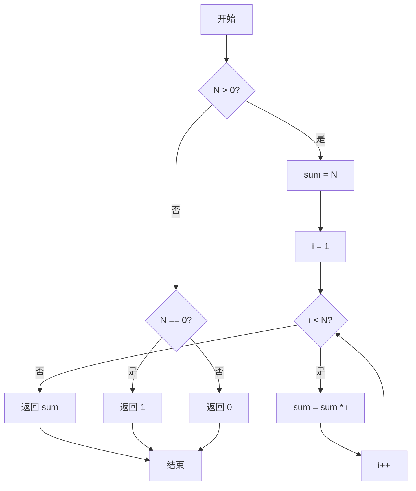
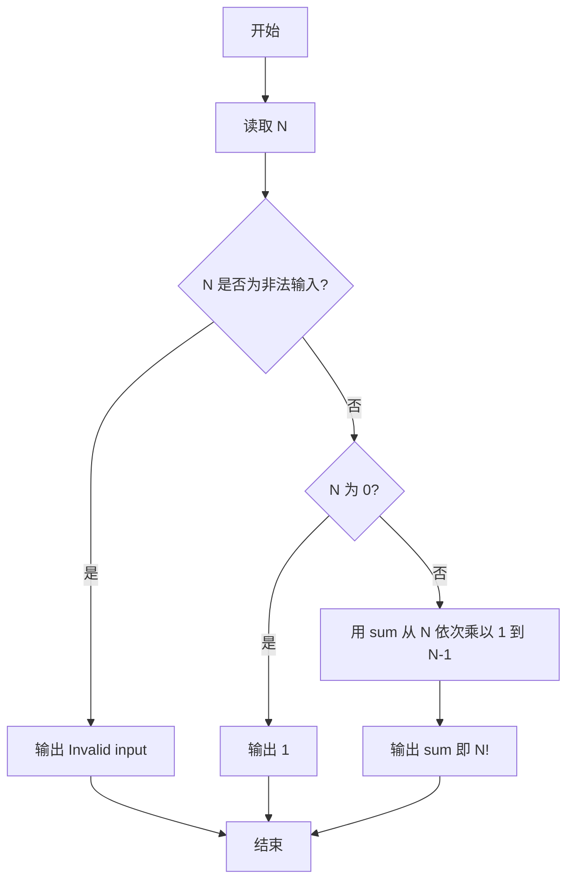

# PTA基础编程题目集 6-8简单阶乘计算（C++语言实现）

## 题目描述

本题要求实现一个计算非负整数阶乘的简单函数。

### 函数接口定义

```cpp
int Factorial( const int N );
```

其中`N`是用户传入的参数，其值不超过12。如果`N`是非负整数，则该函数必须返回`N`的阶乘，否则返回0。

### 裁判测试程序样例

```cpp
#include <stdio.h>

int Factorial( const int N );

int main()
{
    int N, NF;

    scanf("%d", &N);
    NF = Factorial(N);
    if (NF)  printf("%d! = %d\n", N, NF);
    else printf("Invalid input\n");

    return 0;
}

/* 你的代码将被嵌在这里 */
```

### 输入样例

```in
5
```

### 输出样例

```out
5! = 120
```

## 函数部分

非法输入直接返回 0；合法输入统一从乘积 1 开始，因此 `N = 0` 时循环不执行，仍能得到 `0! = 1`。

```cpp
int Factorial(const int N)
{
    if (N < 0) return 0;

    int result = 1;
    for (int i = 2; i <= N; ++i) {
        result *= i;
    }
    return result;
}
```

## 解题思路

这道题的核心是**累乘计算阶乘**：阶乘 n! = 1 × 2 × ... × n，且 0! = 1。先处理特殊情形——N == 0 时返回 1，N < 0 的非法输入返回 0；对 N > 0 的情况累乘得到阶乘。

### 核心问题分析

1. **特殊值处理**：N == 0 时 0! = 1，返回 1；N < 0 为非法输入，返回 0。
2. **累乘计算**：对 N > 0 的情况，先令 sum = N，再让循环变量 i 从 1 乘到 N - 1。
3. **返回值**：返回累乘结果 sum，即为 N!。

### 算法原理说明

阶乘 `n! = 1 × 2 × ... × n`，且 `0! = 1`。思路：先处理特殊情形——`N == 0` 时返回 1，`N < 0` 的非法输入返回 0；对 `N > 0` 的情况，先令 `sum = N`，再让循环变量 `i` 从 1 乘到 `N - 1`，累乘得到 `N` 的阶乘。

### 具体计算步骤

1. 判断 N > 0：成立则进入阶乘计算分支。
2. 初始化 sum = 1，再令 sum = N。
3. 循环变量 i 从 1 递增到 N - 1，每轮执行 sum = sum * i。
4. 循环结束后返回 sum，即为 N!。
5. 若 N == 0 返回 1（即 0!）；否则（N < 0）返回 0。


## 完整代码

```cpp
// 题目：6-8 简单阶乘计算
// 要求：实现Factorial(N)，N>0时计算N!，N==0返回1，N<0返回0
//
// 实现原理：
//   连乘法，先令sum=N，再从1乘到N-1
#include <stdio.h>

int Factorial(const int N);

int main()
{
    int N, NF;
    scanf("%d", &N);
    NF = Factorial(N);
    if (NF) printf("%d! = %d\n", N, NF);
    else printf("Invalid input\n");
    return 0;
}

/* 连乘计算N! */
int Factorial(const int N)
{
    if (N > 0) {
        int i;
        int sum = N;
        for (i = 1; i < N; i++)
            sum = sum * i;
        return sum;
    } else if (N == 0) {
        return 1; // 0! = 1
    } else {
        return 0; // 非法输入
    }
}
```

下面仅给出需要嵌入裁判程序（位于 `/* 你的代码将被嵌在这里 */` 或 `/* 请在这里填写答案 */` 处）的函数实现，可直接复制到提交框：

## 代码流程说明

1. 判断 N > 0：成立则进入阶乘计算分支。
2. 初始化 sum = 1，再令 sum = N。
3. 循环变量 i 从 1 递增到 N - 1，每轮执行 sum = sum * i。
4. 循环结束后返回 sum，即为 N!。
5. 若 N == 0 返回 1（即 0!）；否则（N < 0）返回 0。

## 代码流程图



## 解题流程图



## 复杂度分析

- 时间复杂度：`O(N)`，最多执行 N 次乘法。
- 空间复杂度：`O(1)`，只使用结果变量和循环变量。

## 常见易错点

1. 负数是非法输入，应返回 0，使主程序输出 `Invalid input`。
2. `0!` 的值是 1，不能把 0 直接作为累乘初值返回。
3. 题目保证 N 不超过 12，使用 `int` 保存结果即可；不要忽略题目的范围保证。
