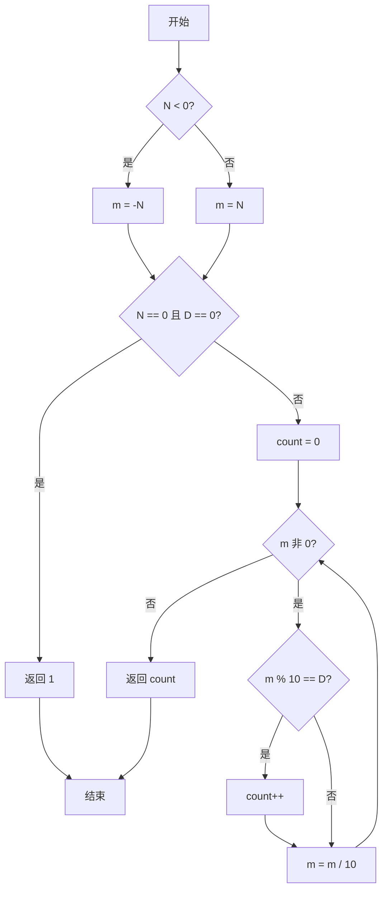
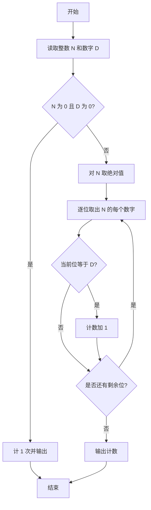

# PTA基础编程题目集 6-9统计个位数字（C++语言实现）

## 题目描述

本题要求实现一个函数，可统计任一整数中某个位数出现的次数。例如-21252中，2出现了3次，则该函数应该返回3。

### 函数接口定义

```cpp
int Count_Digit ( const int N, const int D );
```

其中`N`和`D`都是用户传入的参数。`N`的值不超过`int`的范围；`D`是[0, 9]区间内的个位数。函数须返回`N`中`D`出现的次数。

### 裁判测试程序样例

```cpp
#include <stdio.h>

int Count_Digit ( const int N, const int D );

int main()
{
    int N, D;

    scanf("%d %d", &N, &D);
    printf("%d\n", Count_Digit(N, D));
    return 0;
}

/* 你的代码将被嵌在这里 */
```

### 输入样例

```in
-21252 2
```

### 输出样例

```out
3
```

## 解题思路

这道题的核心是**逐位统计数字出现次数**：每次用 m % 10 取出当前最低位与 D 比较，再用 m /= 10 去掉该位，直到 m 变为 0。同时要处理负数和 N == 0、D == 0 的特殊情况。

### 核心问题分析

1. **负数处理**：N < 0 时先取绝对值存入 m，避免取模结果的符号干扰。
2. **零的特殊情况**：N == 0 且 D == 0 时，while 循环不会执行，需单独判断返回 1。
3. **逐位统计**：每次 m % 10 得到当前最低位，与 D 比较相等则计数加 1，再 m /= 10 去掉该位。

### 算法原理说明

统计数字 `D` 在整数 `N` 中出现的次数，核心是逐位检查：每次用 `m % 10` 取出当前最低位与 `D` 比较，再用 `m /= 10` 去掉该位，直到 `m` 变为 0。需要注意两个特殊情况：负数先取绝对值再处理；`N == 0` 且 `D == 0` 时循环不会执行，需单独判断返回 1。

### 具体计算步骤

1. 将 N 取绝对值存入 m：N < 0 时 m = -N，否则 m = N，用于处理负数。
2. 处理特例：N == 0 且 D == 0 时返回 1。
3. 初始化计数 count = 0。
4. while (m) 循环：m % 10 得到最低位，与 D 比较相等则 count++。
5. m /= 10 去掉已检查的最低位，继续循环。
6. 循环结束返回 count。


## 完整代码

```cpp
// 题目：6-9 统计个位数字
// 要求：实现Count_Digit(N, D)，统计N中数字D出现的次数
//
// 实现原理：
//   取绝对值后逐位取余比较，特判N==0且D==0返回1
#include <stdio.h>

int Count_Digit(const int N, const int D);

int main()
{
    int N, D;
    scanf("%d %d", &N, &D);
    printf("%d\n", Count_Digit(N, D));
    return 0;
}

/* 逐位统计数字D出现的次数 */
int Count_Digit(const int N, const int D)
{
    int m;
    if (N < 0) m = -N;
    else m = N;
    if (N == 0 && D == 0) return 1; // 特殊情况
    int count = 0;
    while (m) {
        if (m % 10 == D) count++;
        m /= 10;
    }
    return count;
}
```

下面仅给出需要嵌入裁判程序（位于 `/* 你的代码将被嵌在这里 */` 或 `/* 请在这里填写答案 */` 处）的函数实现，可直接复制到提交框：

## 代码流程说明

1. 将 N 取绝对值存入 m：N < 0 时 m = -N，否则 m = N，用于处理负数。
2. 处理特例：N == 0 且 D == 0 时返回 1。
3. 初始化计数 count = 0。
4. while (m) 循环：m % 10 得到最低位，与 D 比较相等则 count++。
5. m /= 10 去掉已检查的最低位，继续循环。
6. 循环结束返回 count。

## 代码流程图



## 解题流程图


