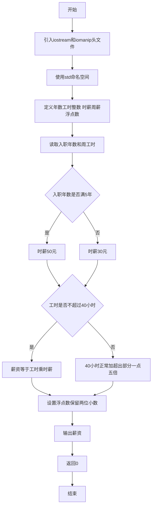
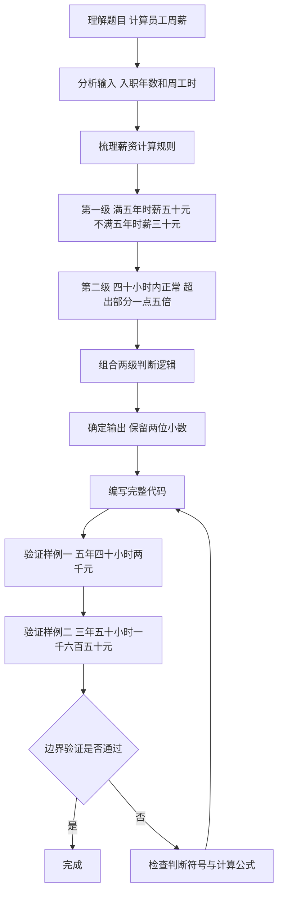

# 7-10 计算工资（C++语言实现）

## 前言

本题（7-10 计算工资）的主要考点是：准确理解题意、规范处理输入输出格式，并正确处理边界与精度。下面先给出题目描述与格式要求，再通过清晰的思路与可直接运行的CPP代码进行讲解。

## 题目描述

某公司员工的工资计算方法如下：一周内工作时间不超过40小时，按正常工作时间计酬；超出40小时的工作时间部分，按正常工作时间报酬的1.5倍计酬。员工按进公司时间分为新职工和老职工，进公司不少于5年的员工为老职工，5年以下的为新职工。新职工的正常工资为30元/小时，老职工的正常工资为50元/小时。请按该计酬方式计算员工的工资。

## 输入格式

输入在一行中给出2个正整数，分别为某员工入职年数和周工作时间，其间以空格分隔。

## 输出格式

在一行输出该员工的周薪，精确到小数点后2位。

## 输入样例1

```in
5 40
```

## 输入样例2

```in
3 50
```

## 输出样例1

```out
2000.00
```

## 输出样例2

```out
1650.00
```

## 解题思路

### 1. 核心问题分析

本题属于两级条件判断 + 分段计算的组合问题。需要先根据入职年数确定小时工资率（新/老职工），再根据周工时是否超过40小时选择不同的薪资计算公式（正常工时或正常+加班1.5倍），最后将结果按保留2位小数输出。

### 2. 算法原理说明

1. **第一级判断（确定工资率rate）：
   - 入职年数 `years >= 5` → 老职工 → `rate = 50.0` 元/小时
   - 否则 → 新职工 → `rate = 30.0` 元/小时
2. **第二级判断（分段计算薪资salary）：
   - 工时 `hours <= 40` → 全部按正常计酬：`salary = hours × rate`
   - 工时 `hours > 40` → 前40小时正常 + 超出部分按1.5倍：`salary = 40×rate + (hours-40)×rate×1.5`
3. **格式化输出**：使用`fixed`和`setprecision(2)`保证输出精确到小数点后2位。

### 3. 具体计算步骤

1. 读入两个正整数：入职年数years、周工时hours。
2. 判断years是否≥5，设置对应rate（50或30）。
3. 判断hours是否≤40，按对应公式计算salary。
4. 输出salary，保留2位小数。

## 完整代码

```cpp
#include <iostream>
#include <iomanip>
using namespace std;

int main(void)
{
    int years, hours;
    double rate, salary;
    
    cin >> years >> hours;
    
    if (years >= 5) {
        rate = 50.0;
    } else {
        rate = 30.0;
    }
    
    if (hours <= 40) {
        salary = hours * rate;
    } else {
        salary = 40 * rate + (hours - 40) * rate * 1.5;
    }
    
    cout << fixed << setprecision(2) << salary << endl;
    return 0;
}
```

## 代码流程说明

1. **引入头文件**：引入`<iostream>`提供标准输入输出，引入`<iomanip>`提供`setprecision`格式控制。
2. **使用命名空间**：`using namespace std;`简化代码。
3. **定义变量**：
   - `years`、`hours`：int类型，分别存储入职年数与周工作时间
   - `rate`：double类型，存储小时工资率
   - `salary`：double类型，存储计算得出的周薪
4. **读取输入**：`cin >> years >> hours;`按顺序读入职年数和周工时。
5. **第一级判断（确定工资率）：
   - `years >= 5`为真 → 老职工，`rate = 50.0`
   - 否则 → 新职工，`rate = 30.0`
6. **第二级判断（计算薪资）：
   - `hours <= 40`为真 → 无加班，`salary = hours × rate`
   - 否则 → 有加班，`salary = 40×rate + (hours-40)×rate×1.5`
7. **格式化输出**：`fixed`和`setprecision(2)`设置固定小数位2位后输出`salary`并换行。
8. **程序结束**：`return 0;`表示程序正常终止。

## 代码流程图



## 解题流程图



## 代码解析

```cpp
#include <iostream>
#include <iomanip>
using namespace std;

int main(void)
{
    int years, hours;
    double rate, salary;
    
    cin >> years >> hours;
    
    if (years >= 5) {
        rate = 50.0;
    } else {
        rate = 30.0;
    }
    
    if (hours <= 40) {
        salary = hours * rate;
    } else {
        salary = 40 * rate + (hours - 40) * rate * 1.5;
    }
    
    cout << fixed << setprecision(2) << salary << endl;
    return 0;
}
```

### 1. 头文件与变量
代码引入 `<iostream>` 完成输入输出，引入 `<iomanip>` 控制小数位数。变量 `years` 和 `hours` 保存入职年数与周工作时间，`rate` 和 `salary` 使用 `double` 处理工资计算。

### 2. 工资率与加班工资
先判断 `years >= 5` 确定正常时薪，再判断工时是否超过40小时。超过部分单独乘以1.5倍时薪，避免把全部工时错误地按加班工资计算。

### 3. 输出结果
最后使用 `fixed << setprecision(2)` 输出工资，保证始终显示两位小数。

## 复杂度分析

设输入规模为 $n$（对数值类题目为参与运算的数据量，对字符串/序列类题目为长度）。

- **时间复杂度**：$O(n)$ 或 $O(n \log n)$，主要来自一次线性遍历与常数次数学运算，无嵌套高复杂度循环。
- **空间复杂度**：$O(n)$，用于存储输入、中间结果与输出字符串；若仅使用若干标量变量则为 $O(1)$。

## 常见易错点

### 1. 输入/输出格式不符
错误：多余空格、遗漏换行、大小写或精度不符。后果：判题系统判为格式错误。正确：严格按题目要求的格式输出，数值用合适精度。

### 2. 边界条件遗漏
错误：未处理 0、最小值、单字符或空输入等边界。后果：特例 WA。正确：先列出所有边界样例，在编码前单独分支处理。

### 3. 整数溢出与类型
错误：使用过小的整数类型或忽略负号。后果：大数计算溢出。正确：按数据范围选择合适类型，必要时用更大整数类型或字符串处理。

## 更多测试

### 测试一：常规边界

**输入：**

```text
4 40
```

**输出：**

```text
1200.00
```

### 测试二：特殊用例

**输入：**

```text
5 41
```

**输出：**

```text
2075.00
```

## 总结

本题的核心在于理清「计算工资」的输入输出关系与边界处理：先按格式读取输入，再依据规则逐步计算或遍历，最后按规范输出。该思路可迁移到同类格式化输入输出与模拟计算的题目。
