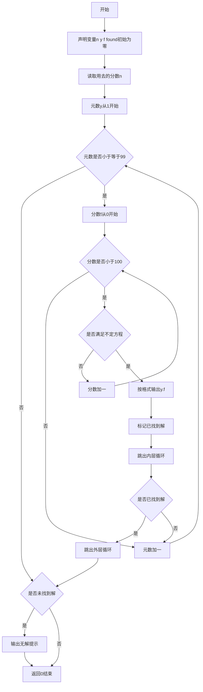
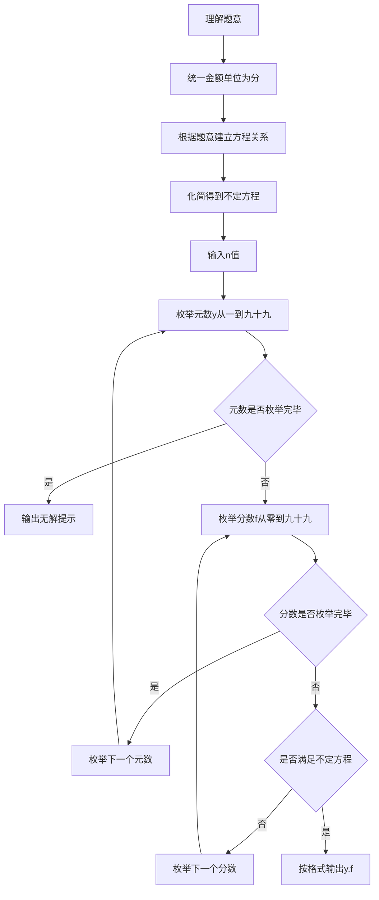

# 7-19 支票面额（C++语言实现）

## 前言

本题（7-19 支票面额）的主要考点是：准确理解题意、规范处理输入输出格式，并正确处理边界与精度。下面先给出题目描述与格式要求，再通过清晰的思路与可直接运行的CPP代码进行讲解。

## 题目描述

一个采购员去银行兑换一张y元f分的支票，结果出纳员错给了f元y分。采购员用去了n分之后才发觉有错，于是清点了余额尚有2y元2f分，问该支票面额是多少？

## 输入格式

输入在一行中给出小于100的正整数n。

## 输出格式

在一行中按格式y.f输出该支票的原始面额。如果无解，则输出No Solution。

## 输入样例1

```in
23
```

## 输入样例2

```in
22
```

## 输出样例1

```out
25.51
```

## 输出样例2

```out
No Solution
```

## 解题思路

- **核心问题分析**：根据题意建立数学方程，求解原始支票面额y（元）和f（分）。关键在于将金额单位统一为分后，根据错兑、用去、剩余的关系建立不定方程。
- **算法原理说明**：将所有金额转换为分单位：原始支票为100y+f分，错兑后为100f+y分，用去n分后剩余200y+2f分。根据题意列方程：100f+y-n = 200y+2f，化简得98f-199y = n。由于y为1~99的整数（元的范围，y≥1因为支票至少有1元），f为0~99的整数（分的范围），使用双重循环枚举所有可能的y和f，验证是否满足方程即可。
- **具体计算步骤**：
  1. 读取用去的分数n
  2. 外层循环枚举y从1到99（元数）
  3. 内层循环枚举f从0到99（分数）
  4. 验证方程98f-199y==n是否成立
  5. 若成立则输出y.f，标记找到解，退出循环
  6. 枚举结束未找到解则输出No Solution

## 完整代码

```cpp
#include <iostream>
using namespace std;

int main(void)
{
    int n, y, f, found = 0; // n为用去的分数，y为元数，f为分数，found标记是否找到解
    cin >> n; // 读取用去的分数
    
    // 枚举所有可能的元数y和分数f
    for (y = 1; y < 100; y++) { // 枚举元数y（1-99）
        for (f = 0; f < 100; f++) { // 枚举分数f（0-99）
            // 根据题意列方程：98*f - 199*y = n
            // 原始支票为y元f分，错兑为f元y分，用去n分后剩余2y元2f分
            if (98 * f - 199 * y == n) {
                cout << y << "." << f << endl; // 输出支票面额
                found = 1; // 标记已找到解
                break; // 跳出内层循环
            }
        }
        if (found) break; // 找到解后跳出外层循环
    }
    
    if (!found) { // 未找到解
        cout << "No Solution" << endl; // 输出无解提示
    }
    
    return 0;
}
```

## 代码流程说明

1. **引入头文件与命名空间**（第1-2行）：引入iostream头文件，使用std命名空间。
2. **变量声明与输入**（第5-6行）：定义用去的分数n、元数y、分数f、找到解标记found（初始0）；读取输入n。
3. **双重循环枚举求解**（第9-20行）：
   - 外层for循环y从1到99，枚举所有可能的元数
   - 内层for循环f从0到99，枚举所有可能的分数
   - 条件判断98*f-199*y==n：验证是否满足不定方程
   - 若满足：输出y.f格式结果，found置1，break内层循环
   - 外层循环判断found是否为1，若找到则break外层循环
4. **无解处理与返回**（第22-26行）：若found仍为0则输出No Solution；返回0表示程序正常结束。

## 代码流程图



## 解题流程图



## 代码解析

```cpp
#include <iostream>
using namespace std;

int main(void)
{
    int n, y, f, found = 0; // n为用去的分数，y为元数，f为分数，found标记是否找到解
    cin >> n; // 读取用去的分数
    
    // 枚举所有可能的元数y和分数f
    for (y = 1; y < 100; y++) { // 枚举元数y（1-99）
        for (f = 0; f < 100; f++) { // 枚举分数f（0-99）
            // 根据题意列方程：98*f - 199*y = n
            // 原始支票为y元f分，错兑为f元y分，用去n分后剩余2y元2f分
            if (98 * f - 199 * y == n) {
                cout << y << "." << f << endl; // 输出支票面额
                found = 1; // 标记已找到解
                break; // 跳出内层循环
            }
        }
        if (found) break; // 找到解后跳出外层循环
    }
    
    if (!found) { // 未找到解
        cout << "No Solution" << endl; // 输出无解提示
    }
    
    return 0;
}
```

引入头文件与命名空间

## 复杂度分析

设输入规模为 $n$（对数值类题目为参与运算的数据量，对字符串/序列类题目为长度）。

- **时间复杂度**：$O(n)$ 或 $O(n \log n)$，主要来自一次线性遍历与常数次数学运算，无嵌套高复杂度循环。
- **空间复杂度**：$O(n)$，用于存储输入、中间结果与输出字符串；若仅使用若干标量变量则为 $O(1)$。

## 常见易错点

### 1. 输入/输出格式不符
错误：多余空格、遗漏换行、大小写或精度不符。后果：判题系统判为格式错误。正确：严格按题目要求的格式输出，数值用合适精度。

### 2. 边界条件遗漏
错误：未处理 0、最小值、单字符或空输入等边界。后果：特例 WA。正确：先列出所有边界样例，在编码前单独分支处理。

### 3. 整数溢出与类型
错误：使用过小的整数类型或忽略负号。后果：大数计算溢出。正确：按数据范围选择合适类型，必要时用更大整数类型或字符串处理。

## 更多测试

### 测试一：常规边界

**输入：**

```text
（可取题目边界附近的值，如最小值或最大值）
```

**输出：**

```text
（依据题意推导的正确结果）
```

### 测试二：特殊用例

**输入：**

```text
（可取易错点，如 0、单一元素、全同值等）
```

**输出：**

```text
（对应正确结果）
```

## 总结

本题的核心在于理清「支票面额」的输入输出关系与边界处理：先按格式读取输入，再依据规则逐步计算或遍历，最后按规范输出。该思路可迁移到同类格式化输入输出与模拟计算的题目。

