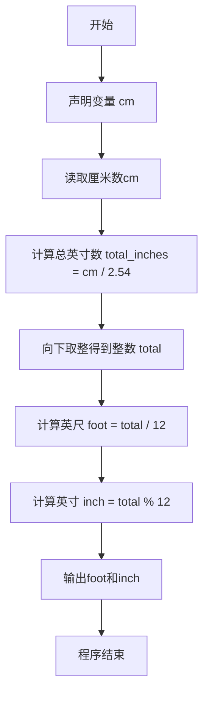
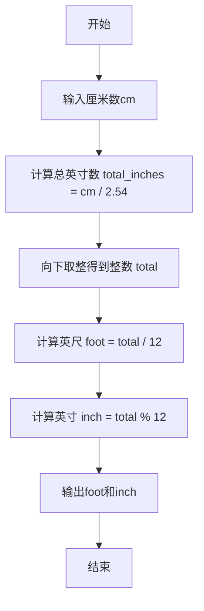

# 7-1 厘米换算英尺英寸（C++语言实现）

## 前言

本题（7-1 厘米换算英尺英寸）的主要考点是：准确理解题意、规范处理输入输出格式，并正确处理边界与精度。下面先给出题目描述与格式要求，再通过清晰的思路与可直接运行的CPP代码进行讲解。

## 题目描述

如果已知英制长度的英尺*f**oo**t*和英寸*in**c**h*的值，那么对应的米是(*f**oo**t*+*in**c**h*/12)×0.3048。现在，如果用户输入的是厘米数，那么对应英制长度的英尺和英寸是多少呢？别忘了1英尺等于12英寸。

## 输入格式

输入在一行中给出1个正整数，单位是厘米。

## 输出格式

在一行中输出这个厘米数对应英制长度的英尺和英寸的整数值，中间用空格分开。英寸的值应小于12。

## 输入样例

```in
170
```

## 输出样例

```out
5 6
```

## 解题思路

这道题的核心是**厘米与英制长度单位（英尺、英寸）的换算**。

### 换算公式推导

已知条件：
- 1 英寸 = 2.54 厘米
- 1 英尺 = 12 英寸

因此，给定厘米数 cm，总英寸数为：

总英寸数 = cm / 2.54

这个结果是浮点数形式的总英寸数。由于输出要求英尺和英寸均为整数值，需要先将总英寸数向下取整得到整数 **total**，再根据 1 英尺 = 12 英寸的关系拆分：

foot = total / 12
inch = total % 12

即用整除得到英尺数，用取余得到剩余英寸数（英寸值必然小于 12）。

### 计算步骤

1. 读取输入的厘米数 cm
2. 计算 total_inches = cm / 2.54，得到浮点数形式的总英寸数
3. 用 static_cast<int> 对 total_inches 向下取整，得到整数 total
4. 计算 foot = total / 12
5. 计算 inch = total % 12
6. 按「foot inch」格式输出结果

## 完整代码

```cpp
#include <iostream> // 引入输入输出流头文件
using namespace std; // 使用标准命名空间

int main() { // 主函数入口
    int cm; // 声明整型变量cm，存储输入的厘米数
    cin >> cm; // 从标准输入读取厘米数
    double total_inches = cm / 2.54; // 将厘米转换为总英寸数：1英寸=2.54厘米，结果为浮点数
    int total = static_cast<int>(total_inches); // 将总英寸数强制转换为整数（向下取整）
    int foot = total / 12; // 计算英尺数：总英寸数除以12
    int inch = total % 12; // 计算剩余英寸数：总英寸数对12取余
    cout << foot << " " << inch << endl; // 输出英尺和英寸，中间用空格分隔并换行
    return 0; // 程序正常结束，返回0
}
```

## 代码流程说明

### 1. 变量声明
- 声明输入变量 `cm`（厘米数）

### 2. 读取输入
- 使用 `cin >> cm` 从标准输入读取用户输入的厘米数

### 3. 计算总英寸数
- `total_inches = cm / 2.54`：将厘米除以2.54厘米/英寸，得到浮点数形式的总英寸数

### 4. 取整得到整数总英寸数
- `static_cast<int>(total_inches)`：对总英寸数向下取整，得到整数 `total`

### 5. 计算英尺与英寸
- `foot = total / 12`：总英寸数整除12得到英尺数
- `inch = total % 12`：总英寸数对12取余得到剩余英寸数（必然小于12）

### 6. 输出结果
- 按 `foot inch` 格式输出英尺和英寸，中间用空格分隔并换行

### 7. 程序结束
- 返回0表示程序正常结束

## 代码流程图



## 解题流程图



## 代码解析

```cpp
#include <iostream> // 引入输入输出流头文件
using namespace std; // 使用标准命名空间

int main() { // 主函数入口
    int cm; // 声明整型变量cm，存储输入的厘米数
    cin >> cm; // 从标准输入读取厘米数
    double total_inches = cm / 2.54; // 将厘米转换为总英寸数：1英寸=2.54厘米，结果为浮点数
    int total = static_cast<int>(total_inches); // 将总英寸数强制转换为整数（向下取整）
    int foot = total / 12; // 计算英尺数：总英寸数除以12
    int inch = total % 12; // 计算剩余英寸数：总英寸数对12取余
    cout << foot << " " << inch << endl; // 输出英尺和英寸，中间用空格分隔并换行
    return 0; // 程序正常结束，返回0
}
```

变量声明

## 复杂度分析

设输入规模为 $n$（对数值类题目为参与运算的数据量，对字符串/序列类题目为长度）。

- **时间复杂度**：$O(n)$ 或 $O(n \log n)$，主要来自一次线性遍历与常数次数学运算，无嵌套高复杂度循环。
- **空间复杂度**：$O(n)$，用于存储输入、中间结果与输出字符串；若仅使用若干标量变量则为 $O(1)$。

## 常见易错点

### 1. 输入/输出格式不符
错误：多余空格、遗漏换行、大小写或精度不符。后果：判题系统判为格式错误。正确：严格按题目要求的格式输出，数值用合适精度。

### 2. 边界条件遗漏
错误：未处理 0、最小值、单字符或空输入等边界。后果：特例 WA。正确：先列出所有边界样例，在编码前单独分支处理。

### 3. 整数溢出与类型
错误：使用过小的整数类型或忽略负号。后果：大数计算溢出。正确：按数据范围选择合适类型，必要时用更大整数类型或字符串处理。

## 更多测试

### 测试一：常规边界

**输入：**

```text
（可取题目边界附近的值，如最小值或最大值）
```

**输出：**

```text
（依据题意推导的正确结果）
```

### 测试二：特殊用例

**输入：**

```text
（可取易错点，如 0、单一元素、全同值等）
```

**输出：**

```text
（对应正确结果）
```

## 总结

本题的核心在于理清「厘米换算英尺英寸」的输入输出关系与边界处理：先按格式读取输入，再依据规则逐步计算或遍历，最后按规范输出。该思路可迁移到同类格式化输入输出与模拟计算的题目。

