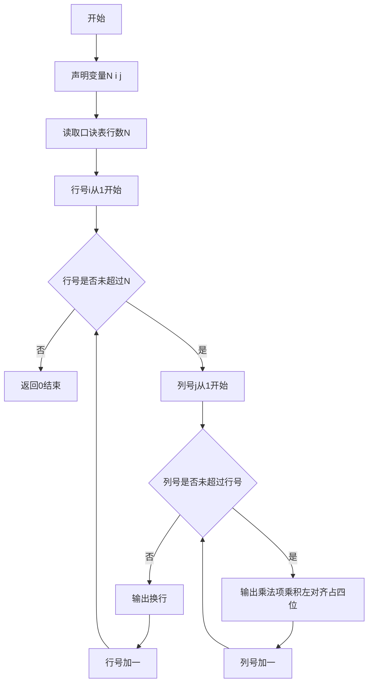
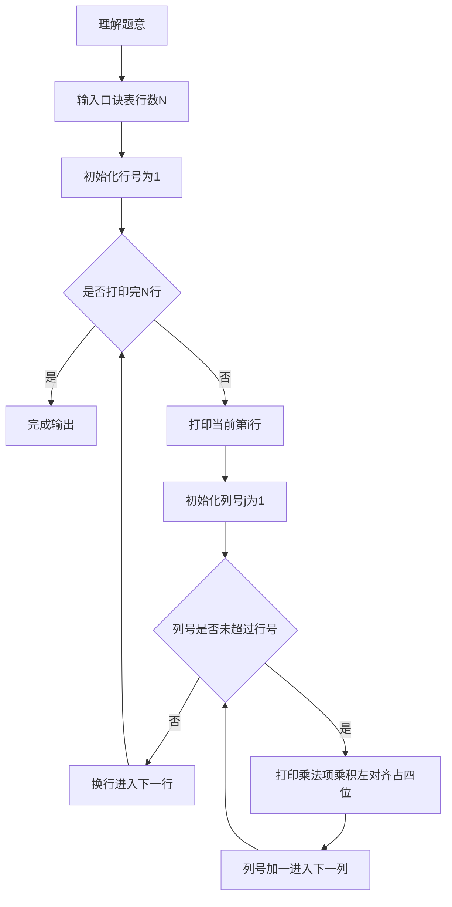

# 7-20 打印九九口诀表（C++语言实现）

## 前言

本题（7-20 打印九九口诀表）的主要考点是：准确理解题意、规范处理输入输出格式，并正确处理边界与精度。下面先给出题目描述与格式要求，再通过清晰的思路与可直接运行的CPP代码进行讲解。

## 题目描述

下面是一个完整的下三角九九口诀表：

1*1=1   
1*2=2   2*2=4   
1*3=3   2*3=6   3*3=9   
1*4=4   2*4=8   3*4=12  4*4=16  
1*5=5   2*5=10  3*5=15  4*5=20  5*5=25  
1*6=6   2*6=12  3*6=18  4*6=24  5*6=30  6*6=36  
1*7=7   2*7=14  3*7=21  4*7=28  5*7=35  6*7=42  7*7=49  
1*8=8   2*8=16  3*8=24  4*8=32  5*8=40  6*8=48  7*8=56  8*8=64  
1*9=9   2*9=18  3*9=27  4*9=36  5*9=45  6*9=54  7*9=63  8*9=72  9*9=81  

本题要求对任意给定的一位正整数N，输出从1*1到N*N的部分口诀表。

## 输入格式
输入在一行中给出一个正整数N（1≤N≤9）。

## 输出格式
输出下三角N*N部分口诀表，其中等号右边数字占4位、左对齐。

## 输入样例
```in
4
```
## 输出样例
```out
1*1=1   
1*2=2   2*2=4   
1*3=3   2*3=6   3*3=9   
1*4=4   2*4=8   3*4=12  4*4=16  
```
## 解题思路

- **核心问题分析**：打印N行N列的下三角九九乘法表，格式要求为：第i行有i个乘法项（i从1到N），每个乘法项格式为j*i=乘积（j从1到i），乘积部分占4位左对齐。
- **算法原理说明**：使用双重循环结构。外层循环控制行数i（1到N），内层循环控制每行的乘法项数j（1到i）。利用iomanip头文件的left与setw(4)设置输出左对齐且占4位宽度，实现乘积数字占4位的格式要求。
- **具体计算步骤**：
  1. 读取正整数N（1≤N≤9）
  2. 外层循环i从1到N（控制当前行数/第二个乘数）
     3. 内层循环j从1到i（控制该行的项数/第一个乘数）
        - 输出格式：j << "*" << i << "=" << left << setw(4) << j*i
     4. 每行输出完毕后换行
  3. 结束程序

## 完整代码

```cpp
#include <iostream>
#include <iomanip>
using namespace std;

int main(void)
{
    int N, i, j; // N为口诀表的行数，i为当前行，j为当前列
    cin >> N; // 读取口诀表行数N
    
    // 输出下三角N*N口诀表
    for (i = 1; i <= N; i++) { // 控制行数，从1到N
        for (j = 1; j <= i; j++) { // 控制每行的乘法项数，从1到当前行号
            cout << j << "*" << i << "=" << left << setw(4) << j * i; // 输出乘法表达式，结果左对齐占4位
        }
        cout << endl; // 换行
    }
    
    return 0;
}
```

## 代码流程说明

1. **引入头文件与命名空间**（第1-3行）：引入iostream和iomanip头文件（iomanip用于setw格式化输出），使用std命名空间。
2. **变量声明与输入**（第6-7行）：定义口诀表行数N、外层循环变量i（行号/第二个乘数）、内层循环变量j（列号/第一个乘数）；读取输入N。
3. **双重循环打印口诀表**（第10-15行）：
   - 外层for循环i从1到N：控制输出N行，i同时作为乘法的第二个操作数
   - 内层for循环j从1到i：第i行输出i个乘法项，j作为乘法的第一个操作数
   - 输出格式：cout << j << "*" << i << "=" << left << setw(4) << j*i；left与setw(4)确保乘积部分左对齐且占4位宽度
   - 内层循环结束后cout << endl换行，进入下一行
4. **返回与结束**（第17行）：返回0表示程序正常结束。

## 代码流程图



## 解题流程图



## 代码解析

```cpp
#include <iostream>
#include <iomanip>
using namespace std;

int main(void)
{
    int N, i, j; // N为口诀表的行数，i为当前行，j为当前列
    cin >> N; // 读取口诀表行数N
    
    // 输出下三角N*N口诀表
    for (i = 1; i <= N; i++) { // 控制行数，从1到N
        for (j = 1; j <= i; j++) { // 控制每行的乘法项数，从1到当前行号
            cout << j << "*" << i << "=" << left << setw(4) << j * i; // 输出乘法表达式，结果左对齐占4位
        }
        cout << endl; // 换行
    }
    
    return 0;
}
```

### 代码执行说明
外层循环控制行号，内层循环输出从1到当前行号的乘法项；乘积用 setw(4) 左对齐，完成一行后换行。

## 复杂度分析

设输入规模为 $n$（对数值类题目为参与运算的数据量，对字符串/序列类题目为长度）。

- **时间复杂度**：$O(n)$ 或 $O(n \log n)$，主要来自一次线性遍历与常数次数学运算，无嵌套高复杂度循环。
- **空间复杂度**：$O(n)$，用于存储输入、中间结果与输出字符串；若仅使用若干标量变量则为 $O(1)$。

## 常见易错点

### 1. 输入/输出格式不符
错误：多余空格、遗漏换行、大小写或精度不符。后果：判题系统判为格式错误。正确：严格按题目要求的格式输出，数值用合适精度。

### 2. 边界条件遗漏
错误：未处理 0、最小值、单字符或空输入等边界。后果：特例 WA。正确：先列出所有边界样例，在编码前单独分支处理。

### 3. 整数溢出与类型
错误：使用过小的整数类型或忽略负号。后果：大数计算溢出。正确：按数据范围选择合适类型，必要时用更大整数类型或字符串处理。

## 更多测试

### 测试一：常规边界

**输入：**

```text
2
```

**输出：**

```text
1*1=1
1*2=2   2*2=4
```

### 测试二：特殊用例

**输入：**

```text
1
```

**输出：**

```text
1*1=1
```

## 总结

本题的核心在于理清「打印九九口诀表」的输入输出关系与边界处理：先按格式读取输入，再依据规则逐步计算或遍历，最后按规范输出。该思路可迁移到同类格式化输入输出与模拟计算的题目。
