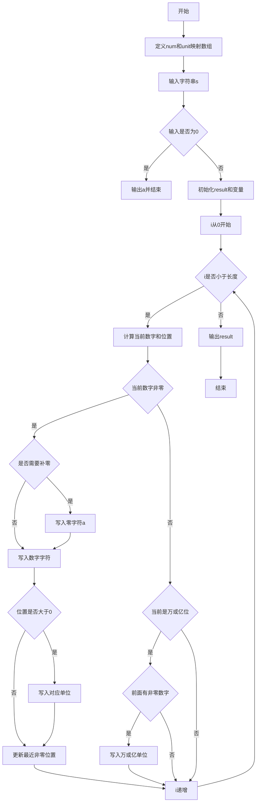
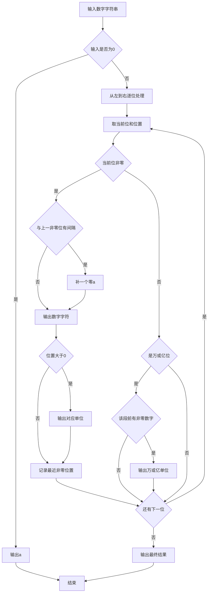

# 7-23 币值转换（C++语言实现）

## 前言

本题（7-23 币值转换）的主要考点是：准确理解题意、规范处理输入输出格式，并正确处理边界与精度。下面先给出题目描述与格式要求，再通过清晰的思路与可直接运行的CPP代码进行讲解。

## 题目描述

输入一个整数（位数不超过9位）代表一个人民币值（单位为元），请转换成财务要求的大写中文格式。如23108元，转换后变成“贰万叁仟壹百零捌”元。为了简化输出，用小写英文字母a-j顺序代表大写数字0-9，用S、B、Q、W、Y分别代表拾、百、仟、万、亿。于是23108元应被转换输出为“cWdQbBai”元。

## 输入格式

输入在一行中给出一个不超过9位的非负整数。

## 输出格式

在一行中输出转换后的结果。注意“零”的用法必须符合中文习惯。

## 输入样例1

```in
813227345
```

## 输入样例2

```in
6900
```

## 输出样例1

```out
iYbQdBcScWhQdBeSf
```

## 输出样例2

```out
gQjB
```

## 解题思路

### 1. 核心问题分析

将数字金额转换为中文财务大写格式，难点在于"零"的处理规则：
1. 连续的多个零只需输出一个"零"(a)
2. 每段末尾（万位、亿位等大单位前）的零可以省略
3. 万位(W)和亿位(Y)作为分段单位，即使该段全零有时也需保留单位

### 2. 算法原理

逐位处理输入字符串。对每一位数字：
- 非零数字：若与上一个非零数字之间隔有零位，先补一个"零"(a)，再输出数字和对应单位
- 零数字：不直接输出，但在遇到万/亿位等大单位时，检查该段是否有非零数字以决定是否输出单位

维护last_non_zero记录上一个非零数字的位置(pos)，用于判断两个非零数字间是否需要补零，以及判断万/亿单位是否有效。

### 3. 具体计算步骤

1. 输入数字字符串s，特判s=="0"时直接输出"a"
2. 从左到右遍历每一位：
   - pos = len-1-i 为当前位的位置权重（个位0、十位1...）
   - 非零数字：若last_non_zero-pos > 1则补"a"，输出数字+单位，更新last_non_zero
   - 零数字：若pos是4或8（万/亿位），且last_non_zero>pos则输出单位
3. 输出结果字符串

## 完整代码

```cpp
#include <iostream>
#include <string>
using namespace std;

// 数字映射：'a'代表0, 'b'代表1, ..., 'j'代表9
char num[] = "abcdefghij"; 
// 单位映射：索引0无单位(个位), 1:拾(S), 2:百(B), 3:仟(Q), 4:万(W), 5:拾(S), 6:百(B), 7:仟(Q), 8:亿(Y)
char unit[] = {'\0', 'S', 'B', 'Q', 'W', 'S', 'B', 'Q', 'Y'}; 

int main()
{
    string s;
    cin >> s;
    int len = s.length();
    
    // 特判：输入为0时直接输出"a"
    if (s == "0") {
        cout << "a" << endl;
        return 0;
    }
    
    string result; // 存储转换后的结果字符串
    int last_non_zero = -1;  // 记录上一个非零数字的位置（从右往左数的位数）
    
    // 从左向右遍历输入的每一位数字
    for (int i = 0; i < len; i++) {
        int d = s[i] - '0';        // 当前数字
        int pos = len - 1 - i;      // 当前数字的位置权重（个位为0，十位为1...）
        
        if (d != 0) {
            // 如果当前非零数字与上一个非零数字之间隔了至少一位（即存在零），则需要补一个"零"(a)
            // 例如：101 -> 百位1和个位1之间隔了十位(pos=1)，需要补零
            if (last_non_zero != -1 && last_non_zero - pos > 1) {
                result += num[0];
            }
            // 添加当前数字对应的字符
            result += num[d];
            // 添加对应的单位（个位pos=0时不加单位）
            if (pos > 0) {
                result += unit[pos];
            }
            last_non_zero = pos; // 更新最近非零数字的位置
        } else {
            // 当前数字为0时的处理
            // 对于"万"(pos=4)和"亿"(pos=8)这样的大单位，即使其中间数位为0，也需要保留单位
            // 例如：813227345中，亿位后面的千万、百万等都是0，但仍需输出"Y"(亿)
            if (pos % 4 == 0 && pos > 0) {
                // 只有当前面出现过非零数字（当前数段有效）时，才输出该大单位
                if (last_non_zero != -1 && last_non_zero > pos) {
                    result += unit[pos];
                }
            }
        }
    }
    
    cout << result << endl;
    return 0;
}
```

## 代码流程说明

1. **字符映射初始化**：num数组映射0-9到a-j，unit数组映射位置到单位
2. **输入与特判**：读取输入字符串，若为"0"直接输出"a"
3. **遍历处理每一位**：
   - 计算当前位数字d和位置pos
   - d≠0时：检查间隔补零→写入数字→写入单位→更新last_non_zero
   - d=0时：若为分段单位(万/亿)且前面有有效数字则写入单位
4. **输出结果**：循环结束后将拼接好的result字符串直接输出

## 代码流程图



## 解题流程图



## 代码解析

```cpp
#include <iostream>
#include <string>
using namespace std;

// 数字映射：'a'代表0, 'b'代表1, ..., 'j'代表9
char num[] = "abcdefghij"; 
// 单位映射：索引0无单位(个位), 1:拾(S), 2:百(B), 3:仟(Q), 4:万(W), 5:拾(S), 6:百(B), 7:仟(Q), 8:亿(Y)
char unit[] = {'\0', 'S', 'B', 'Q', 'W', 'S', 'B', 'Q', 'Y'}; 

int main()
{
    string s;
    cin >> s;
    int len = s.length();
    
    // 特判：输入为0时直接输出"a"
    if (s == "0") {
        cout << "a" << endl;
        return 0;
    }
    
    string result; // 存储转换后的结果字符串
    int last_non_zero = -1;  // 记录上一个非零数字的位置（从右往左数的位数）
    
    // 从左向右遍历输入的每一位数字
    for (int i = 0; i < len; i++) {
        int d = s[i] - '0';        // 当前数字
        int pos = len - 1 - i;      // 当前数字的位置权重（个位为0，十位为1...）
        
        if (d != 0) {
            // 如果当前非零数字与上一个非零数字之间隔了至少一位（即存在零），则需要补一个"零"(a)
            // 例如：101 -> 百位1和个位1之间隔了十位(pos=1)，需要补零
            if (last_non_zero != -1 && last_non_zero - pos > 1) {
                result += num[0];
            }
            // 添加当前数字对应的字符
            result += num[d];
            // 添加对应的单位（个位pos=0时不加单位）
            if (pos > 0) {
                result += unit[pos];
            }
            last_non_zero = pos; // 更新最近非零数字的位置
        } else {
            // 当前数字为0时的处理
            // 对于"万"(pos=4)和"亿"(pos=8)这样的大单位，即使其中间数位为0，也需要保留单位
            // 例如：813227345中，亿位后面的千万、百万等都是0，但仍需输出"Y"(亿)
            if (pos % 4 == 0 && pos > 0) {
                // 只有当前面出现过非零数字（当前数段有效）时，才输出该大单位
                if (last_non_zero != -1 && last_non_zero > pos) {
                    result += unit[pos];
                }
            }
        }
    }
    
    cout << result << endl;
    return 0;
}
```

### 代码执行说明
num 和 unit 数组分别提供数字及单位映射。扫描每一位时追加非零数字和单位，在跨越零位时补一个零，并按有效数段保留万、亿单位。

## 复杂度分析

设输入规模为 $n$（对数值类题目为参与运算的数据量，对字符串/序列类题目为长度）。

- **时间复杂度**：$O(n)$ 或 $O(n \log n)$，主要来自一次线性遍历与常数次数学运算，无嵌套高复杂度循环。
- **空间复杂度**：$O(n)$，用于存储输入、中间结果与输出字符串；若仅使用若干标量变量则为 $O(1)$。

## 常见易错点

### 1. 输入/输出格式不符
错误：多余空格、遗漏换行、大小写或精度不符。后果：判题系统判为格式错误。正确：严格按题目要求的格式输出，数值用合适精度。

### 2. 边界条件遗漏
错误：未处理 0、最小值、单字符或空输入等边界。后果：特例 WA。正确：先列出所有边界样例，在编码前单独分支处理。

### 3. 整数溢出与类型
错误：使用过小的整数类型或忽略负号。后果：大数计算溢出。正确：按数据范围选择合适类型，必要时用更大整数类型或字符串处理。

## 更多测试

### 测试一：常规边界

**输入：**

```text
10000
```

**输出：**

```text
bW
```

### 测试二：特殊用例

**输入：**

```text
0
```

**输出：**

```text
a
```

## 总结

本题的核心在于理清「币值转换」的输入输出关系与边界处理：先按格式读取输入，再依据规则逐步计算或遍历，最后按规范输出。该思路可迁移到同类格式化输入输出与模拟计算的题目。
