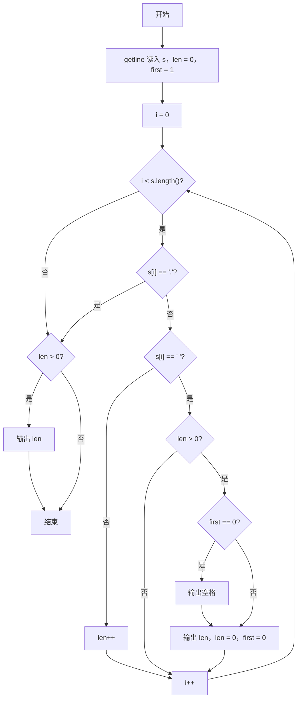
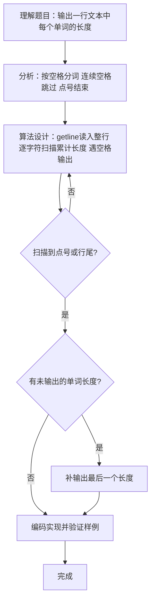

# 7-26 单词长度（C++语言实现）

## 前言

本题（7-26 单词长度）的主要考点是：准确理解题意、规范处理输入输出格式，并正确处理边界与精度。下面先给出题目描述与格式要求，再通过清晰的思路与可直接运行的CPP代码进行讲解。

## 题目描述

你的程序要读入一行文本，其中以空格分隔为若干个单词，以.结束。你要输出每个单词的长度。这里的单词与语言无关，可以包括各种符号，比如it's算一个单词，长度为4。注意，行中可能出现连续的空格；最后的.不计算在内。

## 输入格式

输入在一行中给出一行文本，以.结束

提示：用scanf("%c",...);来读入一个字符，直到读到.为止。

## 输出格式

在一行中输出这行文本对应的单词的长度，每个长度之间以空格隔开，行末没有最后的空格。

## 输入样例

```in
It's great to see you here.
```

## 输出样例

```out
4 5 2 3 3 4
```

## 解题思路

**核心问题分析**：本题需要读入整行文本，识别空格分隔的单词并统计每个单词的长度，遇到'.'时结束处理。难点在于处理连续空格（不能输出多余的0长度）和行末无多余空格的格式要求。

**算法原理说明**：采用getline读入整行后再逐字符扫描的方法，使用一个计数器`len`记录当前单词的长度：遇到'.'时立即终止扫描；遇到空格时若已有字符计数（`len>0`）则输出该长度并重置计数器；遇到其他字符则`len`自增。使用`first`标记控制空格输出，确保行末无多余空格。循环结束后若`len`仍大于0，再补输出最后一个单词的长度。

### 1. 具体计算步骤

1. 初始化`len=0`（当前单词长度）、`first=1`（第一个单词标记）
2. 使用`getline(cin, s)`读入整行文本
3. 遍历字符串s的每个字符：
   - 若为'.'，终止遍历
   - 若为空格且`len>0`：按`first`决定是否先输出空格，输出`len`并重置计数器
   - 否则（普通字符）：单词长度`len`加1
4. 遍历结束后，若`len`仍大于0，再输出最后一个单词的长度

## 完整代码

```cpp
#include <iostream>
#include <string>
using namespace std;

int main() {
    string s;
    getline(cin, s);
    int len = 0;
    int first = 1;
    for (size_t i = 0; i < s.length(); i++) {
        if (s[i] == '.') break;
        if (s[i] == ' ') {
            if (len > 0) {
                if (!first) cout << " ";
                cout << len;
                len = 0;
                first = 0;
            }
        } else {
            len++;
        }
    }
    if (len > 0) {
        if (!first) cout << " ";
        cout << len;
    }
    return 0;
}
```

## 代码流程说明

1. **变量初始化**：定义字符串`s`存储读入的整行文本，`len=0`作为单词长度计数器，`first=1`标记是否为第一个输出的单词（用于控制空格分隔）
2. **读入整行**：使用`getline(cin, s)`读入以'.'结尾的一行文本
3. **遍历字符**：for循环从`i=0`遍历到`s.length()-1`：
   - 遇到'.'：break终止扫描
   - 遇到空格：若`len>0`说明当前单词结束，按`first`决定是否先输出空格，输出`len`后重置`len=0`并将`first`置0
   - 其他字符：`len++`累加当前单词长度
4. **收尾处理**：循环结束后，若`len>0`说明还有以'.'结尾前的单词未输出，按同样规则补输出最后一个单词的长度
5. **程序结束**：返回0表示正常结束

## 代码流程图



## 解题流程图



## 代码解析

```cpp
#include <iostream>
#include <string>
using namespace std;

int main() {
    string s;
    getline(cin, s);
    int len = 0;
    int first = 1;
    for (size_t i = 0; i < s.length(); i++) {
        if (s[i] == '.') break;
        if (s[i] == ' ') {
            if (len > 0) {
                if (!first) cout << " ";
                cout << len;
                len = 0;
                first = 0;
            }
        } else {
            len++;
        }
    }
    if (len > 0) {
        if (!first) cout << " ";
        cout << len;
    }
    return 0;
}
```

变量初始化

## 复杂度分析

设输入规模为 $n$（对数值类题目为参与运算的数据量，对字符串/序列类题目为长度）。

- **时间复杂度**：$O(n)$ 或 $O(n \log n)$，主要来自一次线性遍历与常数次数学运算，无嵌套高复杂度循环。
- **空间复杂度**：$O(n)$，用于存储输入、中间结果与输出字符串；若仅使用若干标量变量则为 $O(1)$。

## 常见易错点

### 1. 输入/输出格式不符
错误：多余空格、遗漏换行、大小写或精度不符。后果：判题系统判为格式错误。正确：严格按题目要求的格式输出，数值用合适精度。

### 2. 边界条件遗漏
错误：未处理 0、最小值、单字符或空输入等边界。后果：特例 WA。正确：先列出所有边界样例，在编码前单独分支处理。

### 3. 整数溢出与类型
错误：使用过小的整数类型或忽略负号。后果：大数计算溢出。正确：按数据范围选择合适类型，必要时用更大整数类型或字符串处理。

## 更多测试

### 测试一：常规边界

**输入：**

```text
（可取题目边界附近的值，如最小值或最大值）
```

**输出：**

```text
（依据题意推导的正确结果）
```

### 测试二：特殊用例

**输入：**

```text
（可取易错点，如 0、单一元素、全同值等）
```

**输出：**

```text
（对应正确结果）
```

## 总结

本题的核心在于理清「单词长度」的输入输出关系与边界处理：先按格式读取输入，再依据规则逐步计算或遍历，最后按规范输出。该思路可迁移到同类格式化输入输出与模拟计算的题目。

