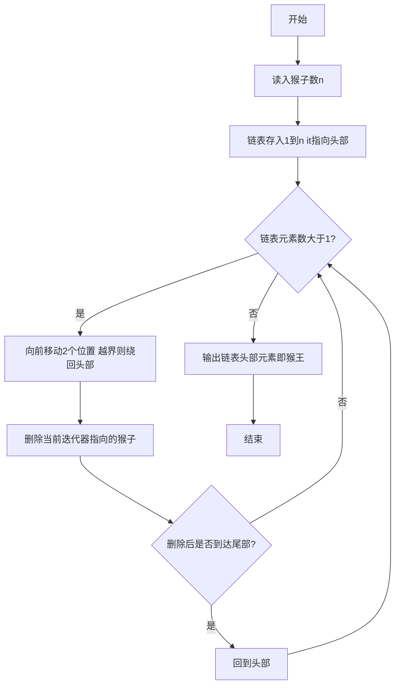
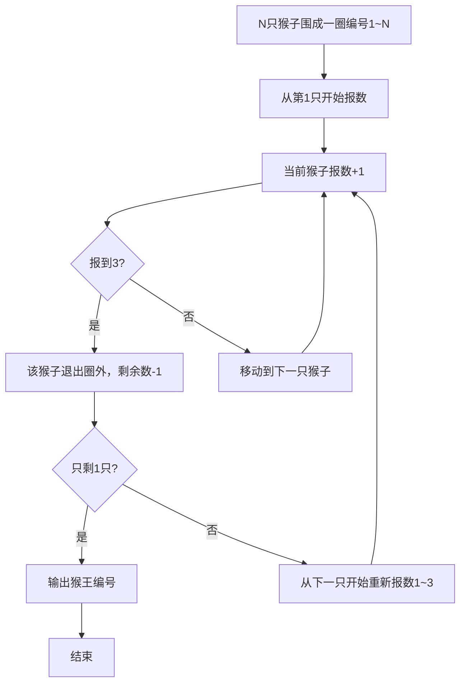

# 7-28 猴子选大王（C++语言实现）

## 前言

本题（7-28 猴子选大王）的主要考点是：准确理解题意、规范处理输入输出格式，并正确处理边界与精度。下面先给出题目描述与格式要求，再通过清晰的思路与可直接运行的CPP代码进行讲解。

## 题目描述

一群猴子要选新猴王。新猴王的选择方法是：让N只候选猴子围成一圈，从某位置起顺序编号为1~N号。从第1号开始报数，每轮从1报到3，凡报到3的猴子即退出圈子，接着又从紧邻的下一只猴子开始同样的报数。如此不断循环，最后剩下的一只猴子就选为猴王。请问是原来第几号猴子当选猴王？

## 输入格式

输入在一行中给一个正整数N（≤1000）。

## 输出格式

在一行中输出当选猴王的编号。

## 输入样例

```in
11
```

## 输出样例

```out
7
```

## 解题思路

**核心问题分析**：本题是经典的约瑟夫环问题，N只猴子围成一圈依次报数1~3，报到3的退出，求最后剩下的猴子编号。需要模拟循环报数和淘汰过程，关键是在删除报到3的猴子后，如何继续维持环形报数而不出现越界。

**算法原理说明**：使用std::list保存1到N的猴子编号，迭代器it指向当前报数的猴子。循环在链表元素数大于1时持续：每轮向前移动2步（从1报到3需跳过2只猴子），移动过程中若到达链表尾部则绕回头部；然后删除it指向的猴子，若删除后到达尾部同样绕回头部。

### 1. 具体计算步骤

1. 创建链表monkeys，将1到n的猴子编号依次push_back入链表
2. 迭代器it指向链表头部，作为当前报数位置
3. 当链表元素数大于1时循环：for循环i从1到2，每次it++，若it到达end()则回到begin()
4. it = monkeys.erase(it)删除报到3的猴子，若删除后it到达end()则回到begin()
5. 循环结束后输出monkeys.front()即猴王编号

## 完整代码

```cpp
#include <iostream>
#include <list>
using namespace std;

int main() {
    int n;
    cin >> n;
    
    list<int> monkeys;
    for (int i = 1; i <= n; i++) {
        monkeys.push_back(i);
    }
    
    auto it = monkeys.begin();
    while (monkeys.size() > 1) {
        for (int i = 1; i < 3; i++) {
            it++;
            if (it == monkeys.end()) it = monkeys.begin();
        }
        it = monkeys.erase(it);
        if (it == monkeys.end()) it = monkeys.begin();
    }
    
    cout << monkeys.front() << endl;
    
    return 0;
}
```

## 代码流程说明

1. **初始化**：读入猴子总数n，创建链表monkeys，将1到n的猴子编号依次push_back入链表
2. **迭代器初始化**：迭代器it指向链表头部，作为当前报数的起点
3. **淘汰循环**：当链表元素数大于1时持续执行
   - for循环i从1到2，每次it++，若it到达链表尾部end()则绕回头部（从1报到3需跳过2只猴子）
   - it = monkeys.erase(it)删除当前迭代器指向的猴子，erase返回下一个有效位置
   - 若删除后it到达end()则绕回头部
4. **输出猴王**：循环结束后链表只剩一个元素，输出monkeys.front()即为猴王编号

## 代码流程图



## 解题流程图



## 代码解析

```cpp
#include <iostream>
#include <list>
using namespace std;

int main() {
    int n;
    cin >> n;
    
    list<int> monkeys;
    for (int i = 1; i <= n; i++) {
        monkeys.push_back(i);
    }
    
    auto it = monkeys.begin();
    while (monkeys.size() > 1) {
        for (int i = 1; i < 3; i++) {
            it++;
            if (it == monkeys.end()) it = monkeys.begin();
        }
        it = monkeys.erase(it);
        if (it == monkeys.end()) it = monkeys.begin();
    }
    
    cout << monkeys.front() << endl;
    
    return 0;
}
```

### 代码执行说明
list 按顺序保存1到N号猴子，迭代器从第一只开始。每轮前进两步指向报数3者，删除后从下一只继续报数。

## 复杂度分析

设输入规模为 $n$（对数值类题目为参与运算的数据量，对字符串/序列类题目为长度）。

- **时间复杂度**：$O(n)$ 或 $O(n \log n)$，主要来自一次线性遍历与常数次数学运算，无嵌套高复杂度循环。
- **空间复杂度**：$O(n)$，用于存储输入、中间结果与输出字符串；若仅使用若干标量变量则为 $O(1)$。

## 常见易错点

### 1. 输入/输出格式不符
错误：多余空格、遗漏换行、大小写或精度不符。后果：判题系统判为格式错误。正确：严格按题目要求的格式输出，数值用合适精度。

### 2. 边界条件遗漏
错误：未处理 0、最小值、单字符或空输入等边界。后果：特例 WA。正确：先列出所有边界样例，在编码前单独分支处理。

### 3. 整数溢出与类型
错误：使用过小的整数类型或忽略负号。后果：大数计算溢出。正确：按数据范围选择合适类型，必要时用更大整数类型或字符串处理。

## 更多测试

### 测试一：常规边界

**输入：**

```text
3
```

**输出：**

```text
2
```

### 测试二：特殊用例

**输入：**

```text
1
```

**输出：**

```text
1
```

## 总结

本题的核心在于理清「猴子选大王」的输入输出关系与边界处理：先按格式读取输入，再依据规则逐步计算或遍历，最后按规范输出。该思路可迁移到同类格式化输入输出与模拟计算的题目。
