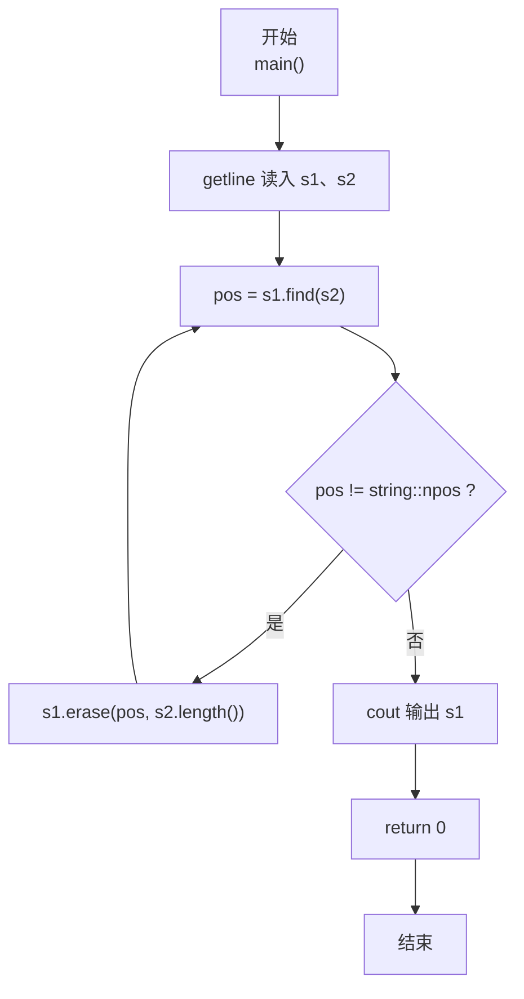
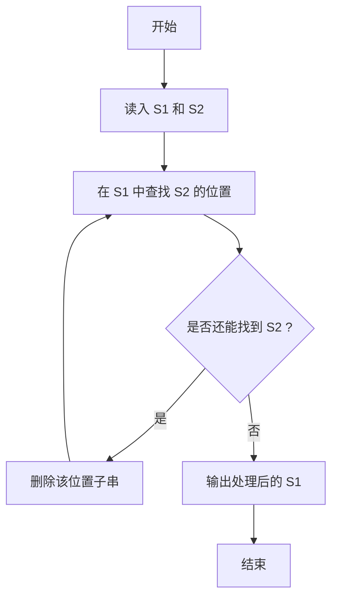

# 7-29 删除字符串中的子串（C++语言实现）

## 前言

本题（7-29 删除字符串中的子串）的主要考点是：准确理解题意、规范处理输入输出格式，并正确处理边界与精度。下面先给出题目描述与格式要求，再通过清晰的思路与可直接运行的CPP代码进行讲解。

## 题目描述

输入2个字符串S1和S2，要求删除字符串S1中出现的所有子串S2，即结果字符串中不能包含S2。

## 输入格式

输入在2行中分别给出不超过80个字符长度的、以回车结束的2个非空字符串，对应S1和S2。

## 输出格式

在一行中输出删除字符串S1中出现的所有子串S2后的结果字符串。

## 输入样例

```in
Tomcat is a male ccatat
cat
```

## 输出样例

```out
Tom is a male 
```

## 解题思路

这道题的核心是**反复删除子串直到完全消失**：删除 S1 中某处出现的 S2 后，剩余字符重新拼接可能再次形成 S2（包括重叠情况），因此必须循环执行"查找→删除"，直到 S1 中不再包含 S2 为止。

### 核心问题分析

1. **循环删除**：每次删除后都要重新查找，不能只删一次。
2. **终止条件**：当 `find` 返回 `string::npos`（表示未找到）时说明已全部删除，循环结束。
3. **样例验证**：样例中删除 "cat" 后，剩余字符拼接又形成新的 "cat"，印证了必须循环删除。

### 算法原理说明

利用 C++ string 的 `find` 与 `erase` 接口：

pos = s1.find(s2)     // 查找子串首次出现位置
s1.erase(pos, s2.length())  // 删除该位置的子串

将两者放入循环：`while ((pos = s1.find(s2)) != string::npos) { s1.erase(pos, s2.length()); }`，即可保证删除所有（含重叠产生的）子串。

### 具体计算步骤

1. `getline` 读入 S1 和 S2 两行字符串。
2. 循环执行 `pos = s1.find(s2)` 查找子串。
3. 若 `pos != string::npos`：调用 `s1.erase(pos, s2.length())` 删除子串，回到第 2 步继续查找。
4. 若 `find` 返回 `string::npos`：循环结束。
5. 输出删除完成后的 S1。

## 完整代码

```cpp
#include <iostream>
#include <string>
using namespace std;

int main() {
    string s1, s2;
    getline(cin, s1);
    getline(cin, s2);
    
    size_t pos;
    while ((pos = s1.find(s2)) != string::npos) {
        s1.erase(pos, s2.length());
    }
    
    cout << s1 << endl;
    
    return 0;
}
```

## 代码流程说明

### 1. 读入字符串
- `getline(cin, s1)`、`getline(cin, s2)`：分别读取两行字符串，保留空格。

### 2. 循环查找并删除
- `while ((pos = s1.find(s2)) != string::npos)`：每次循环先查找 S2 在 S1 中的位置；
- 找到（`pos != string::npos`）则 `s1.erase(pos, s2.length())` 删除，并进入下一轮重新查找。

### 3. 输出
- 循环结束后 S1 中已不含 S2，`cout << s1 << endl` 输出结果。

## 代码流程图



## 解题流程图



## 代码解析

```cpp
#include <iostream>
#include <string>
using namespace std;

int main() {
    string s1, s2;
    getline(cin, s1);
    getline(cin, s2);
    
    size_t pos;
    while ((pos = s1.find(s2)) != string::npos) {
        s1.erase(pos, s2.length());
    }
    
    cout << s1 << endl;
    
    return 0;
}
```

### 代码执行说明
使用 getline 保留整行内容；每次 find 找到子串后用 erase 删除，循环直到字符串中不再出现目标子串。

## 复杂度分析

设输入规模为 $n$（对数值类题目为参与运算的数据量，对字符串/序列类题目为长度）。

- **时间复杂度**：$O(n)$ 或 $O(n \log n)$，主要来自一次线性遍历与常数次数学运算，无嵌套高复杂度循环。
- **空间复杂度**：$O(n)$，用于存储输入、中间结果与输出字符串；若仅使用若干标量变量则为 $O(1)$。

## 常见易错点

### 1. 输入/输出格式不符
错误：多余空格、遗漏换行、大小写或精度不符。后果：判题系统判为格式错误。正确：严格按题目要求的格式输出，数值用合适精度。

### 2. 边界条件遗漏
错误：未处理 0、最小值、单字符或空输入等边界。后果：特例 WA。正确：先列出所有边界样例，在编码前单独分支处理。

### 3. 整数溢出与类型
错误：使用过小的整数类型或忽略负号。后果：大数计算溢出。正确：按数据范围选择合适类型，必要时用更大整数类型或字符串处理。

## 更多测试

### 测试一：常规边界

**输入：**

```text
aaaaa
aa
```

**输出：**

```text
a
```

### 测试二：特殊用例

**输入：**

```text
abc
x
```

**输出：**

```text
abc
```

## 总结

本题的核心在于理清「删除字符串中的子串」的输入输出关系与边界处理：先按格式读取输入，再依据规则逐步计算或遍历，最后按规范输出。该思路可迁移到同类格式化输入输出与模拟计算的题目。
