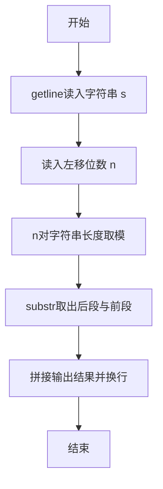
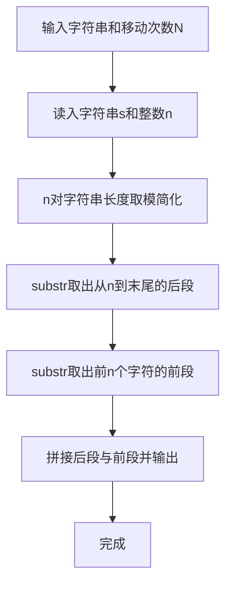

# 7-31 字符串循环左移（C++语言实现）

## 前言

本题（7-31 字符串循环左移）的主要考点是：准确理解题意、规范处理输入输出格式，并正确处理边界与精度。下面先给出题目描述与格式要求，再通过清晰的思路与可直接运行的CPP代码进行讲解。

## 题目描述

输入一个字符串和一个非负整数N，要求将字符串循环左移N次。

## 输入格式

输入在第1行中给出一个不超过100个字符长度的、以回车结束的非空字符串；第2行给出非负整数N。

## 输出格式

在一行中输出循环左移N次后的字符串。

## 输入样例

```in
Hello World!
2
```

## 输出样例

```out
llo World!He
```

## 解题思路

### 核心问题分析
循环左移N次的本质是将字符串前N个字符移动到字符串末尾。例如"Hello World!"左移2次，就是将前2个字符"He"移动到末尾，得到"llo World!He"。由于循环左移具有周期性，左移N次等价于左移N % 字符串长度次。

### 算法原理说明
利用string的substr切片拼接方法：
- 先用`n = n % s.length()`对移动次数取模，消除多余循环移动
- `s.substr(n)`取出从第n个字符到末尾的后段
- `s.substr(0, n)`取出前n个字符的前段
- 二者拼接即为循环左移n次后的完整字符串，一次输出即可
- 时间复杂度O(len)

### 具体计算步骤
1. 读取输入字符串s（可含空格）和整数N
2. 对N取模：N = N % s.length()，避免重复移动
3. 用s.substr(N)取出后段字符串
4. 用s.substr(0, N)取出前段字符串
5. 将后段与前段拼接并输出

## 完整代码

```cpp
#include <iostream>
#include <string>
using namespace std;

int main() {
    string s;
    getline(cin, s);
    int n;
    cin >> n;
    n = n % s.length();
    
    cout << s.substr(n) << s.substr(0, n) << endl;
    
    return 0;
}
```

## 代码流程说明

1. **头文件引入**：引入iostream和string头文件，用于输入输出和字符串处理
2. **读取字符串**：使用getline读取整行字符串（可包含空格）存入string变量s
3. **读取左移位数**：输入非负整数n
4. **取模优化**：n = n % s.length()，当n大于等于字符串长度时只需移动余数次数
5. **输出后段**：s.substr(n)取出从第n个字符到末尾的后段，作为结果的前半部分
6. **输出前段**：s.substr(0, n)取出前n个字符，作为结果的后半部分
7. **输出换行**：将两部分拼接后输出并换行

## 代码流程图



## 解题流程图



## 代码解析

```cpp
#include <iostream>
#include <string>
using namespace std;

int main() {
    string s;
    getline(cin, s);
    int n;
    cin >> n;
    n = n % s.length();
    
    cout << s.substr(n) << s.substr(0, n) << endl;
    
    return 0;
}
```

头文件引入

## 复杂度分析

设输入规模为 $n$（对数值类题目为参与运算的数据量，对字符串/序列类题目为长度）。

- **时间复杂度**：$O(n)$ 或 $O(n \log n)$，主要来自一次线性遍历与常数次数学运算，无嵌套高复杂度循环。
- **空间复杂度**：$O(n)$，用于存储输入、中间结果与输出字符串；若仅使用若干标量变量则为 $O(1)$。

## 常见易错点

### 1. 输入/输出格式不符
错误：多余空格、遗漏换行、大小写或精度不符。后果：判题系统判为格式错误。正确：严格按题目要求的格式输出，数值用合适精度。

### 2. 边界条件遗漏
错误：未处理 0、最小值、单字符或空输入等边界。后果：特例 WA。正确：先列出所有边界样例，在编码前单独分支处理。

### 3. 整数溢出与类型
错误：使用过小的整数类型或忽略负号。后果：大数计算溢出。正确：按数据范围选择合适类型，必要时用更大整数类型或字符串处理。

## 更多测试

### 测试一：常规边界

**输入：**

```text
（可取题目边界附近的值，如最小值或最大值）
```

**输出：**

```text
（依据题意推导的正确结果）
```

### 测试二：特殊用例

**输入：**

```text
（可取易错点，如 0、单一元素、全同值等）
```

**输出：**

```text
（对应正确结果）
```

## 总结

本题的核心在于理清「字符串循环左移」的输入输出关系与边界处理：先按格式读取输入，再依据规则逐步计算或遍历，最后按规范输出。该思路可迁移到同类格式化输入输出与模拟计算的题目。

