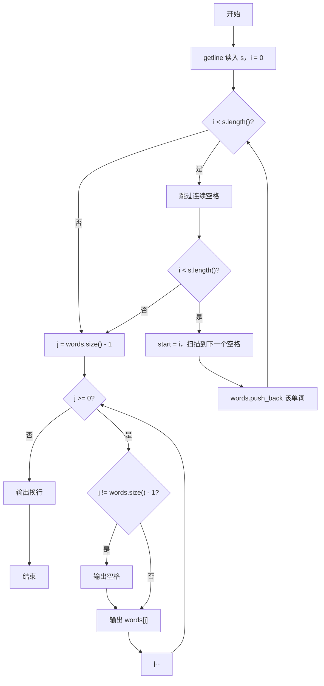
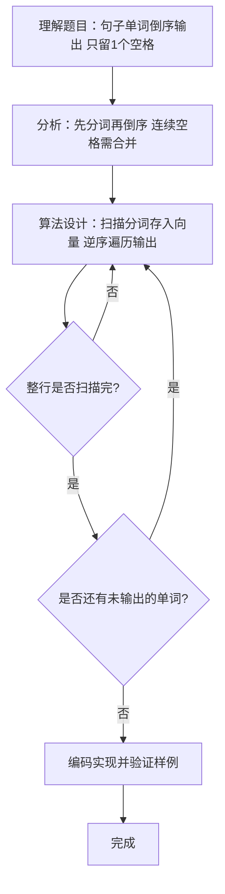

# 7-32 说反话-加强版（C++语言实现）

## 前言

本题（7-32 说反话-加强版）的主要考点是：准确理解题意、规范处理输入输出格式，并正确处理边界与精度。下面先给出题目描述与格式要求，再通过清晰的思路与可直接运行的CPP代码进行讲解。

## 题目描述

给定一句英语，要求你编写程序，将句中所有单词的顺序颠倒输出。

## 输入格式

测试输入包含一个测试用例，在一行内给出总长度不超过500 000的字符串。字符串由若干单词和若干空格组成，其中单词是由英文字母（大小写有区分）组成的字符串，单词之间用若干个空格分开。

## 输出格式

每个测试用例的输出占一行，输出倒序后的句子，并且保证单词间只有1个空格。

## 输入样例

```in
Hello World   Here I Come
```

## 输出样例

```out
Come I Here World Hello
```

## 解题思路

### 核心问题分析
本题要求将句子中的单词顺序颠倒输出，需要处理两个关键点：一是单词之间可能有多个连续空格，二是输出时单词间只能有一个空格。例如输入"Hello World   Here I Come"，5个单词分别是Hello、World、Here、I、Come，倒序输出即从最后一个单词开始向前输出。

### 算法原理说明
采用"先分词，后倒序输出"的策略：
1. **分词阶段**：用getline读入整行后，遍历字符串跳过连续空格定位到单词起点，再扫描到下一个空格确定单词终点，用substr把单词存入vector<string> words
2. **倒序输出阶段**：从vector末尾向前遍历输出每个单词，除第一个输出的单词（即原句最后一个单词）外，每个单词前先输出一个空格，保证单词间只有一个空格
- 时间复杂度O(n)：一次线性扫描分词加一次线性输出
- 空间复杂度O(w)：w为单词数，vector存储所有单词

### 具体计算步骤
1. 用getline读取整行字符串s
2. 初始化单词向量words和遍历索引i=0
3. 当i < s.length()时：
   - 跳过连续空格，找到第一个非空格字符
   - 若未到字符串末尾，记录start=i为单词起点
   - 继续遍历直到遇到空格，得到单词终点
   - 将s.substr(start, i - start)存入words向量
4. 从j = words.size() - 1倒序到j = 0：
   - 若不是第一个输出的单词，先输出空格
   - 输出words[j]
5. 输出换行符

## 完整代码

```cpp
#include <iostream>
#include <string>
#include <vector>
using namespace std;

int main() {
    string s;
    getline(cin, s);
    
    vector<string> words;
    int i = 0;
    while (i < s.length()) {
        while (i < s.length() && s[i] == ' ') i++;
        if (i < s.length()) {
            int start = i;
            while (i < s.length() && s[i] != ' ') i++;
            words.push_back(s.substr(start, i - start));
        }
    }
    
    for (int j = words.size() - 1; j >= 0; j--) {
        if (j != words.size() - 1) cout << " ";
        cout << words[j];
    }
    cout << endl;
    
    return 0;
}
```

## 代码流程说明

1. **头文件引入**：引入iostream、string和vector头文件
2. **读取输入**：getline读取整行字符串s（可包含空格）
3. **定义辅助容器**：vector<string> words存储每个单词，i=0为遍历索引
4. **扫描分词**：
   - while循环跳过连续空格
   - 找到单词后记录start，继续扫描到下一个空格
   - 用substr提取单词存入words向量
5. **倒序输出**：
   - j从最后一个单词下标开始倒序
   - 非首个输出单词前加空格
   - 输出words[j]
6. **输出换行**：结束

## 代码流程图



## 解题流程图



## 代码解析

```cpp
#include <iostream>
#include <string>
#include <vector>
using namespace std;

int main() {
    string s;
    getline(cin, s);
    
    vector<string> words;
    int i = 0;
    while (i < s.length()) {
        while (i < s.length() && s[i] == ' ') i++;
        if (i < s.length()) {
            int start = i;
            while (i < s.length() && s[i] != ' ') i++;
            words.push_back(s.substr(start, i - start));
        }
    }
    
    for (int j = words.size() - 1; j >= 0; j--) {
        if (j != words.size() - 1) cout << " ";
        cout << words[j];
    }
    cout << endl;
    
    return 0;
}
```

头文件引入

## 复杂度分析

设输入规模为 $n$（对数值类题目为参与运算的数据量，对字符串/序列类题目为长度）。

- **时间复杂度**：$O(n)$ 或 $O(n \log n)$，主要来自一次线性遍历与常数次数学运算，无嵌套高复杂度循环。
- **空间复杂度**：$O(n)$，用于存储输入、中间结果与输出字符串；若仅使用若干标量变量则为 $O(1)$。

## 常见易错点

### 1. 输入/输出格式不符
错误：多余空格、遗漏换行、大小写或精度不符。后果：判题系统判为格式错误。正确：严格按题目要求的格式输出，数值用合适精度。

### 2. 边界条件遗漏
错误：未处理 0、最小值、单字符或空输入等边界。后果：特例 WA。正确：先列出所有边界样例，在编码前单独分支处理。

### 3. 整数溢出与类型
错误：使用过小的整数类型或忽略负号。后果：大数计算溢出。正确：按数据范围选择合适类型，必要时用更大整数类型或字符串处理。

## 更多测试

### 测试一：常规边界

**输入：**

```text
（可取题目边界附近的值，如最小值或最大值）
```

**输出：**

```text
（依据题意推导的正确结果）
```

### 测试二：特殊用例

**输入：**

```text
（可取易错点，如 0、单一元素、全同值等）
```

**输出：**

```text
（对应正确结果）
```

## 总结

本题的核心在于理清「说反话-加强版」的输入输出关系与边界处理：先按格式读取输入，再依据规则逐步计算或遍历，最后按规范输出。该思路可迁移到同类格式化输入输出与模拟计算的题目。

