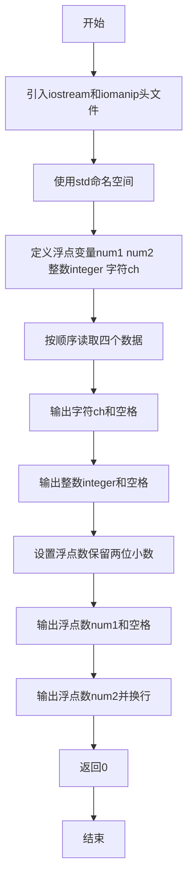
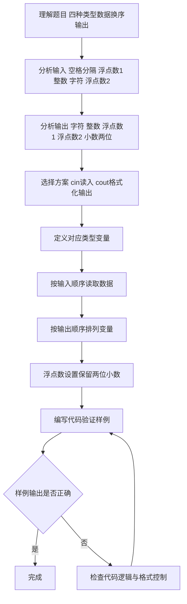

# 7-6 混合类型数据格式化输入（C++语言实现）

## 前言

本题（7-6 混合类型数据格式化输入）的主要考点是：准确理解题意、规范处理输入输出格式，并正确处理边界与精度。下面先给出题目描述与格式要求，再通过清晰的思路与可直接运行的CPP代码进行讲解。

## 题目描述

本题要求编写程序，顺序读入浮点数1、整数、字符、浮点数2，再按照字符、整数、浮点数1、浮点数2的顺序输出。

## 输入格式

输入在一行中顺序给出浮点数1、整数、字符、浮点数2，其间以1个空格分隔。

## 输出格式

在一行中按照字符、整数、浮点数1、浮点数2的顺序输出，其中浮点数保留小数点后2位。

## 输入样例

```in
2.12 88 c 4.7
```

## 输出样例

```out
c 88 2.12 4.70
```

## 解题思路

### 1. 核心问题分析

本题主要考察不同类型数据的输入输出操作，核心在于按指定顺序读入4个不同类型的数据，然后按另一种指定顺序输出，并对浮点数进行格式化处理（保留2位小数）。

### 2. 算法原理说明

1. 利用C++标准输入流`cin`可以自动识别数据类型并按空格分隔读取的特性，依次读取浮点数、整数、字符、浮点数。
2. 利用C++标准输出流`cout`配合格式控制符（`fixed`和`setprecision(2)`）实现浮点数保留两位小数的格式化输出。
3. 输出时按照题目要求调整变量的输出顺序即可。

### 3. 具体计算步骤

1. 定义4个变量：`num1`（double）、`integer`（int）、`ch`（char）、`num2`（double）。
2. 按顺序读入4个数据存入对应变量。
3. 按字符→整数→浮点数1→浮点数2的顺序输出，浮点数保留2位小数。

## 完整代码

```cpp
#include <iostream>
#include <iomanip>
using namespace std;

int main(void)
{
    double num1, num2;
    int integer;
    char ch;
    
    cin >> num1 >> integer >> ch >> num2;
    cout << ch << " " << integer << " " 
         << fixed << setprecision(2) 
         << num1 << " " << num2 << endl;
    
    return 0;
}
```

## 代码流程说明

1. **引入头文件**：引入`<iostream>`提供标准输入输出功能，引入`<iomanip>`提供格式化输出控制（如`setprecision`）。
2. **使用命名空间**：`using namespace std;`简化代码，无需每次写`std::`前缀。
3. **定义变量**：
   - `num1`、`num2`：double类型，存储两个浮点数
   - `integer`：int类型，存储整数
   - `ch`：char类型，存储字符
4. **读取输入**：`cin >> num1 >> integer >> ch >> num2;`按顺序读取4个不同类型的数据，`cin`自动以空格为分隔符解析输入。
5. **格式化输出**：
   - 先输出`ch`（字符）和空格，再输出`integer`（整数）和空格
   - 使用`fixed`和`setprecision(2)`设置浮点数输出格式为固定小数位、保留2位
   - 依次输出`num1`、空格、`num2`，最后换行
6. **程序结束**：`return 0;`表示程序正常终止。

## 代码流程图



## 解题流程图



## 代码解析

```cpp
#include <iostream>
#include <iomanip>
using namespace std;

int main(void)
{
    double num1, num2;
    int integer;
    char ch;
    
    cin >> num1 >> integer >> ch >> num2;
    cout << ch << " " << integer << " " 
         << fixed << setprecision(2) 
         << num1 << " " << num2 << endl;
    
    return 0;
}
```

### 代码执行说明
程序按浮点数、整数、字符、浮点数的顺序读取数据，输出时调整为字符、整数、浮点数1、浮点数2，并用 fixed 与 setprecision(2) 控制小数格式。

## 复杂度分析

设输入规模为 $n$（对数值类题目为参与运算的数据量，对字符串/序列类题目为长度）。

- **时间复杂度**：$O(n)$ 或 $O(n \log n)$，主要来自一次线性遍历与常数次数学运算，无嵌套高复杂度循环。
- **空间复杂度**：$O(n)$，用于存储输入、中间结果与输出字符串；若仅使用若干标量变量则为 $O(1)$。

## 常见易错点

### 1. 输入/输出格式不符
错误：多余空格、遗漏换行、大小写或精度不符。后果：判题系统判为格式错误。正确：严格按题目要求的格式输出，数值用合适精度。

### 2. 边界条件遗漏
错误：未处理 0、最小值、单字符或空输入等边界。后果：特例 WA。正确：先列出所有边界样例，在编码前单独分支处理。

### 3. 整数溢出与类型
错误：使用过小的整数类型或忽略负号。后果：大数计算溢出。正确：按数据范围选择合适类型，必要时用更大整数类型或字符串处理。

## 更多测试

### 测试一：常规边界

**输入：**

```text
0 0 a 3
```

**输出：**

```text
a 0 0.00 3.00
```

### 测试二：特殊用例

**输入：**

```text
12.5 -3 Z 0
```

**输出：**

```text
Z -3 12.50 0.00
```

## 总结

本题的核心在于理清「混合类型数据格式化输入」的输入输出关系与边界处理：先按格式读取输入，再依据规则逐步计算或遍历，最后按规范输出。该思路可迁移到同类格式化输入输出与模拟计算的题目。
