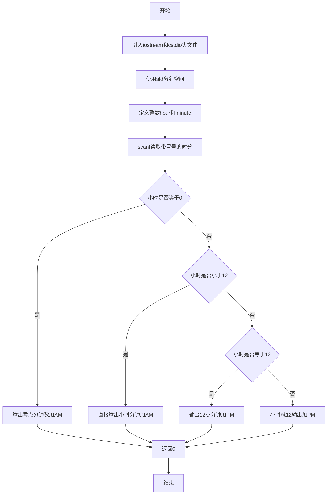
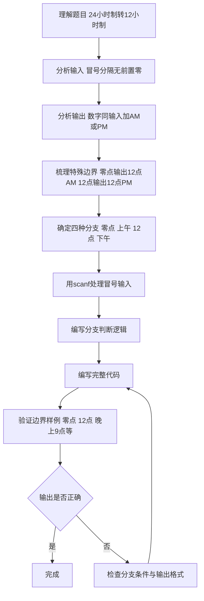

# 7-7 12-24小时制（C++语言实现）

## 前言

本题（7-7 12-24小时制）的主要考点是：准确理解题意、规范处理输入输出格式，并正确处理边界与精度。下面先给出题目描述与格式要求，再通过清晰的思路与可直接运行的CPP代码进行讲解。

## 题目描述

编写一个程序，要求用户输入24小时制的时间，然后显示12小时制的时间。

## 输入格式

输入在一行中给出带有中间的:符号（半角的冒号）的24小时制的时间，如12:34表示12点34分。当小时或分钟数小于10时，均没有前导的零，如5:6表示5点零6分。

提示：在scanf的格式字符串中加入:，让scanf来处理这个冒号。

## 输出格式

在一行中输出这个时间对应的12小时制的时间，数字部分格式与输入的相同，然后跟上空格，再跟上表示上午的字符串AM或表示下午的字符串PM。如5:6 PM表示下午5点零6分。注意，在英文的习惯中，中午12点被认为是下午，所以24小时制的12:00就是12小时制的12:0 PM；而0点被认为是第二天的时间，所以是0:0 AM。

## 输入样例

```in
21:11
```

## 输出样例

```out
9:11 PM
```

## 解题思路

### 1. 核心问题分析

本题需要完成两个核心任务：一是正确读取带有冒号分隔符的时间输入，二是根据24小时制到12小时制的转换规则进行分支判断输出。关键边界点在于0点、12点这两个特殊时间点的处理。

### 2. 算法原理说明

1. **带分隔符输入处理**：使用`scanf("%d:%d", &hour, &minute)`可以直接处理冒号分隔，格式字符串中的`:`会自动匹配并跳过输入中的冒号字符。
2. **时间转换规则**（分4种情况）：
   - `hour == 0`：凌晨0点 → 输出"12:分钟 AM"
   - `0 < hour < 12`：上午 → 直接输出"小时:分钟 AM"
   - `hour == 12`：中午12点 → 输出"12:分钟 PM"
   - `hour > 12`：下午 → 小时减12，输出"(hour-12):分钟 PM"

### 3. 具体计算步骤

1. 读入小时和分钟（处理冒号分隔）。
2. 按上述4种情况进行分支判断。
3. 按判断结果输出转换后的时间和AM/PM标识。

## 完整代码

```cpp
#include <iostream>
#include <cstdio>
using namespace std;

int main() {
    int hour, minute;
    
    scanf("%d:%d", &hour, &minute);
    
    if (hour == 0) {
        cout << "12:" << minute << " AM";
    } else if (hour < 12) {
        cout << hour << ":" << minute << " AM";
    } else if (hour == 12) {
        cout << "12:" << minute << " PM";
    } else {
        cout << hour - 12 << ":" << minute << " PM";
    }
    
    return 0;
}
```

## 代码流程说明

1. **引入头文件**：引入`<iostream>`提供标准输出功能，引入`<cstdio>`提供`scanf`函数用于处理带冒号的输入。
2. **使用命名空间**：`using namespace std;`简化代码。
3. **定义变量**：`hour`和`minute`均为int类型，分别存储小时和分钟。
4. **读取输入**：`scanf("%d:%d", &hour, &minute);`使用格式字符串中的冒号自动匹配并跳过输入中的冒号，将小时存入`hour`、分钟存入`minute`。
5. **分支判断转换**：
   - 情况1：`hour == 0` → 输出"12:分钟 AM"（凌晨零点）
   - 情况2：`hour < 12`且不等于0 → 直接输出"小时:分钟 AM"（上午时段）
   - 情况3：`hour == 12` → 输出"12:分钟 PM"（中午12点算下午）
   - 情况4：`hour > 12` → 小时减12后输出"(hour-12):分钟 PM"（下午1点到11点）
6. **程序结束**：`return 0;`表示程序正常终止。

## 代码流程图



## 解题流程图



## 代码解析

```cpp
#include <iostream>
#include <cstdio>
using namespace std;

int main() {
    int hour, minute;
    
    scanf("%d:%d", &hour, &minute);
    
    if (hour == 0) {
        cout << "12:" << minute << " AM";
    } else if (hour < 12) {
        cout << hour << ":" << minute << " AM";
    } else if (hour == 12) {
        cout << "12:" << minute << " PM";
    } else {
        cout << hour - 12 << ":" << minute << " PM";
    }
    
    return 0;
}
```

引入头文件

## 复杂度分析

设输入规模为 $n$（对数值类题目为参与运算的数据量，对字符串/序列类题目为长度）。

- **时间复杂度**：$O(n)$ 或 $O(n \log n)$，主要来自一次线性遍历与常数次数学运算，无嵌套高复杂度循环。
- **空间复杂度**：$O(n)$，用于存储输入、中间结果与输出字符串；若仅使用若干标量变量则为 $O(1)$。

## 常见易错点

### 1. 输入/输出格式不符
错误：多余空格、遗漏换行、大小写或精度不符。后果：判题系统判为格式错误。正确：严格按题目要求的格式输出，数值用合适精度。

### 2. 边界条件遗漏
错误：未处理 0、最小值、单字符或空输入等边界。后果：特例 WA。正确：先列出所有边界样例，在编码前单独分支处理。

### 3. 整数溢出与类型
错误：使用过小的整数类型或忽略负号。后果：大数计算溢出。正确：按数据范围选择合适类型，必要时用更大整数类型或字符串处理。

## 更多测试

### 测试一：常规边界

**输入：**

```text
（可取题目边界附近的值，如最小值或最大值）
```

**输出：**

```text
（依据题意推导的正确结果）
```

### 测试二：特殊用例

**输入：**

```text
（可取易错点，如 0、单一元素、全同值等）
```

**输出：**

```text
（对应正确结果）
```

## 总结

本题的核心在于理清「12-24小时制」的输入输出关系与边界处理：先按格式读取输入，再依据规则逐步计算或遍历，最后按规范输出。该思路可迁移到同类格式化输入输出与模拟计算的题目。

